<p align="center"></p>

# pvx


`pvx` is a Python toolkit for high-quality time and pitch processing using a phase-vocoder/short-time Fourier transform (STFT) core.

It is designed for users who need musically usable results under both normal and extreme processing conditions, including long time stretching, formant-aware pitch movement, transient-sensitive material, and stereo/multichannel coherence preservation.

Primary project goals and differentiators:
- audio quality first (phase coherence, transient integrity, formant stability, stereo coherence)
- speed second (throughput/runtime tuning only after quality targets are met)
- multichannel-native audio processing

At a glance, `pvx` provides:
- a unified command-line interface (CLI) (`pvx`) plus installed tool entry points (`pvxvoc`, `pvxfreeze`, and others)
- focused tools (`voc`, `freeze`, `harmonize`, `retune`, `morph`, and more) with shared argument conventions
- deterministic central processing unit (CPU) paths for reproducible runs, plus optional graphics processing unit (GPU)/Compute Unified Device Architecture (CUDA) acceleration where available
- native Apple Silicon support in the CPU path
- comma-separated values (CSV)-driven automation workflows for segment-wise and trajectory-driven processing
- microtonal support (ratio, cents, and scale-constrained retune workflows)
- shared mastering/output controls (target loudness units relative to full scale (LUFS), limiting, clipping, dithering, and output policy options)
- comprehensive generated documentation (Markdown, HyperText Markup Language (HTML), and Portable Document Format (PDF))

## Table of Contents

- [Value Proposition](#value-proposition)
- [Install](#install)
- [Start Here (No Prior DSP Knowledge Needed)](#start-here-no-prior-dsp-knowledge-needed)
- [What Is a Phase Vocoder? (No Math Version)](#what-is-a-phase-vocoder-no-math-version)
- [Analog Tape Methods for Pitch/Time Shifting](#analog-tape-methods-for-pitchtime-shifting)
- [Mental Model (1 Minute)](#mental-model-1-minute)
- [30-Second Quick Start](#30-second-quick-start)
- [Unified CLI (Primary Entry Point)](#unified-cli-primary-entry-point)
- [5-Minute Tutorial (Single-File Workflow)](#5-minute-tutorial-single-file-workflow)
- [Conceptual Overview: What Is a Phase Vocoder?](#conceptual-overview-what-is-a-phase-vocoder)
- [When To Use Which Tool (Decision Tree)](#when-to-use-which-tool-decision-tree)
- [Common Workflows](#common-workflows)
- [Supported File Types](#supported-file-types)
- [Performance and GPU (Quality-First)](#performance-and-gpu-quality-first)
- [CLI Discoverability and UX](#cli-discoverability-and-ux)
- [Announcement Readiness: Top 5 Complaints (and Fixes)](#announcement-readiness-top-5-complaints-and-fixes)
- [AI Research and Data Augmentation](#ai-research-and-data-augmentation)
- [Benchmarking (pvx vs Rubber Band vs librosa)](#benchmarking-pvx-vs-rubber-band-vs-librosa)
- [Visual Documentation](#visual-documentation)
- [Troubleshooting](#troubleshooting)
- [FAQ](#faq)
- [Why This Matters](#why-this-matters)
- [Lessons from Paul Koonce's PVC Package](#lessons-from-paul-koonces-pvc-package)
- [Progressive Documentation Map](#progressive-documentation-map)
- [Community and Governance](#community-and-governance)
- [License](#license)
- [Attribution](#attribution)

## Value Proposition

`pvx` is designed for users who care more about artifact control than raw throughput. In practical terms:

- higher control density than typical one-knob stretch tools (phase, transient, stereo coherence, formant, and mastering layers in one command surface)
- explicit reproducibility for research and production (deterministic central processing unit (CPU) mode, manifests, benchmark gates, and stable command syntax)
- first-class automation for time-varying control-rate signals (comma-separated values (CSV)/JavaScript Object Notation (JSON) interpolation, routing, `follow`, and `chain`)
- one unified command-line interface (CLI) (`pvx`) with backwards-compatible direct entry points (`pvxvoc`, `pvxfreeze`, etc.)

## Install

```bash
python3 -m venv .venv
source .venv/bin/activate
python3 -m pip install -e .
pvx --help
```

Or with `uv`:

```bash
uv venv .venv
source .venv/bin/activate
uv pip install -e .
uv run pvx --help
```

Persist `pvx` on your shell path (`zsh`):

```bash
printf 'export PATH="%s/.venv/bin:$PATH"\n' "$(pwd)" >> ~/.zshrc
source ~/.zshrc
pvx --help
```

Optional CUDA:

```bash
python3 -m pip install cupy-cuda12x
```

`uv` equivalent:

```bash
uv pip install cupy-cuda12x
```

Man pages are generated during `make install` / `make install-dev`:

```bash
python3 scripts/scripts_install_man_pages.py
MANPATH="$(pwd)/man:$MANPATH" man pvx
```

### Installation and Runtime Matrix

| Platform / Runtime | CPU mode | GPU/CUDA mode | Notes |
| --- | --- | --- | --- |
| Linux x86_64 | Supported | Supported (CUDA + CuPy) | Best choice for NVIDIA CUDA acceleration. |
| Windows x86_64 | Supported | Supported (CUDA + CuPy) | Match CuPy package to installed CUDA runtime. |
| macOS Intel | Supported | Not CUDA | Use CPU mode; Metal acceleration is not a CUDA path. |
| macOS Apple Silicon (M1/M2/M3/M4) | Supported (native arm64) | Not CUDA | Native Apple Silicon support in CPU path; prefer quality-focused profiles first. |

Primary command:

```bash
pvx voc input.wav --stretch 1.2 --output output.wav
```

Fallback without `PATH` updates:

```bash
.venv/bin/pvx voc input.wav --stretch 1.2 --output output.wav
# or
python3 -m pvx.cli.pvx voc input.wav --stretch 1.2 --output output.wav
```

Fallback with `uv`:

```bash
uv run pvx voc input.wav --stretch 1.2 --output output.wav
```

Legacy wrappers remain available for backward compatibility.

## Start Here (No Prior DSP Knowledge Needed)

If this is your first phase-vocoder workflow, think of `pvx` as:
- a way to make audio longer/shorter without changing musical note center
- a way to change pitch without changing duration
- a way to do both while protecting attacks, timbre, and stereo image

You do not need to understand the math first. Start with copy-paste commands, listen, then adjust one parameter at a time. No ceremonial DSP robes required.

### 60-Second First Render

```bash
python3 -m venv .venv
source .venv/bin/activate
python3 -m pip install -e .
pvx voc input.wav --stretch 1.20 --output output.wav
```

Same flow with `uv`:

```bash
uv venv .venv
source .venv/bin/activate
uv pip install -e .
uv run pvx voc input.wav --stretch 1.20 --output output.wav
```

If `pvx` is not found after install:

```bash
printf 'export PATH="%s/.venv/bin:$PATH"\n' "$(pwd)" >> ~/.zshrc
source ~/.zshrc
pvx --help
```

If that does not work, it is usually a `PATH` issue, which is both common and mildly annoying.

No `PATH` fallback:

```bash
.venv/bin/pvx voc input.wav --stretch 1.20 --output output.wav
# or
python3 -m pvx.cli.pvx voc input.wav --stretch 1.20 --output output.wav
```

`uv` fallback (no `PATH` changes):

```bash
uv run pvx voc input.wav --stretch 1.20 --output output.wav
```

What you should hear:
- same pitch
- about 20% longer duration
- minor artifact risk on sharp percussive attacks
- a small sense of relief that it worked first go

### Stretch vs Pitch Shift (Plain Language)

| Operation | What changes | What should stay the same |
| --- | --- | --- |
| Time stretch (`--stretch`) | Duration/tempo | Pitch/key |
| Pitch shift (`--pitch`, `--cents`, `--ratio`) | Pitch/key | Duration/tempo |
| Combined stretch + pitch | Both | Clarity, transients, stereo image (as much as possible) |

Concrete examples:
- `--stretch 2.0`: a 5-second file becomes about 10 seconds.
- `--pitch 12`: one octave up.
- `--pitch -12`: one octave down.
- `--ratio 3/2`: perfect fifth up (just ratio).

### Beginner Command Pack (Copy/Paste)

```bash
# Slower speech review
pvx voc speech.wav --preset vocal_studio --stretch 1.30 --output speech_slow.wav

# Faster speech review
pvx voc speech.wav --preset vocal_studio --stretch 0.85 --output speech_fast.wav

# Pitch up without changing speed
pvx voc vocal.wav --stretch 1.0 --pitch 3 --output vocal_up3.wav

# Pitch down with formant protection
pvx voc vocal.wav --stretch 1.0 --pitch -4 --pitch-mode formant-preserving --output vocal_down4_formant.wav

# Drum-safe stretch
pvx voc drums.wav --preset drums_safe --stretch 1.25 --output drums_safe.wav

# Stereo coherence lock
pvx voc mix.wav --stretch 1.2 --stereo-mode mid_side_lock --coherence-strength 0.9 --output mix_lock.wav

# Freeze one moment into a pad
pvx freeze hit.wav --freeze-time 0.25 --duration 12 --output hit_freeze.wav

# Morph two sounds
pvx morph a.wav b.wav --alpha 0.4 --output morph.wav

# Cross-synthesis: keep A timing/phase but imprint B timbre envelope
pvx morph a.wav b.wav --blend-mode carrier_a_envelope_b --alpha 0.75 --envelope-lifter 32 --output morph_env.wav

# True A->B trajectory morph over time (single command)
pvx morph A.wav B.wav --alpha controls/alpha_curve.csv --interp linear --output morph_traj.wav

# Mono source flying through a captured 4-channel space (A->B trajectory)
pvx trajectory-reverb source.wav --ir room_4ch.wav --coord-system cartesian --start -1,0,1 --end 1,0,1 --output flythrough.wav

# Retune to a major scale
pvx retune vocal.wav --root C --scale major --strength 0.85 --output vocal_retuned.wav

# Retune with alternate concert pitch (A4 = 432 Hz)
pvx retune vocal.wav --root A --scale minor --a4-reference-hz 432 --output vocal_a432.wav

# Retune with an explicit root fundamental (C4 ~= 261.6256 Hz)
pvx retune vocal.wav --root-hz 261.6256 --scale major --output vocal_c4_root.wav

# Ask pvx to recommend and use a root fundamental from the file
pvx retune vocal.wav --recommend-root --scale minor --output vocal_auto_root.wav

# Denoise then dereverb in one pipe
pvx denoise noisy.wav --reduction-db 8 --stdout | pvx deverb - --strength 0.3 --output cleaned.wav
```

More runnable recipes (72): [docs/EXAMPLES.md](docs/EXAMPLES.md)

Wild experimentation pack (100 ideas): [docs/CRAZY_100.md](docs/CRAZY_100.md)

If you run these and everything sounds exactly the same, either the command failed quietly or your source was already suspiciously perfect.

### Time-Varying Control Signals (CSV/JSON)

When you want parameters to change over time, pass a comma-separated values (CSV) or JavaScript Object Notation (JSON) file directly to the flag:

```bash
pvx voc input.wav --stretch controls/stretch.csv --interp linear --output output.wav
pvx voc input.wav --pitch-shift-ratio controls/pitch.json --interp polynomial --order 3 --output output.wav
pvx voc input.wav --n-fft controls/nfft.csv --hop-size controls/hop.csv --output output.wav
```

Interpolation choices:
- `--interp none` (stairstep / sample-and-hold)
- `--interp linear` (default)
- `--interp nearest`
- `--interp cubic`
- `--interp exponential` (piecewise exponential easing)
- `--interp s_curve` (piecewise smoothstep S-curve easing)
- `--interp smootherstep` (piecewise quintic S-curve easing)
- `--interp polynomial --order N` (any integer `N >= 1`, default `N=3`; effective degree is capped to `min(N, control_points-1)`)

Polynomial order examples:
- `--interp polynomial --order 1` (global straight-line fit)
- `--interp polynomial --order 2` (quadratic curve)
- `--interp polynomial --order 3` (cubic curve)
- `--interp polynomial --order 5` (higher-order fit; can overshoot)

Point-style CSV:

```csv
time_sec,value
0.0,1.0
1.0,1.5
2.0,2.0
```

Segment-style CSV:

```csv
start_sec,end_sec,value
0.0,0.5,1.0
0.5,1.0,1.25
1.0,2.0,1.6
```

Point-style JSON:

```json
{
  "interpolation": "linear",
  "order": 3,
  "points": [
    {"time_sec": 0.0, "value": 1.0},
    {"time_sec": 1.0, "value": 1.5},
    {"time_sec": 2.0, "value": 2.0}
  ]
}
```

Multi-parameter JSON:

```json
{
  "parameters": {
    "time_stretch": {
      "points": [
        {"time_sec": 0.0, "value": 1.0},
        {"time_sec": 3.0, "value": 2.0}
      ]
    },
    "n_fft": {
      "points": [
        {"time_sec": 0.0, "value": 1024},
        {"time_sec": 3.0, "value": 4096}
      ]
    }
  }
}
```

Important compatibility notes:
- per-parameter dynamic controls (`--stretch some.csv`) cannot be combined with legacy `--pitch-map` / `--pitch-map-stdin` in the same run
- dynamic `--time-stretch` cannot be combined with `--target-duration`

Interpolation graph examples (same control points, different interpolation mode/order):

| Mode | Example curve |
| --- | --- |
| `none (stairstep)` | 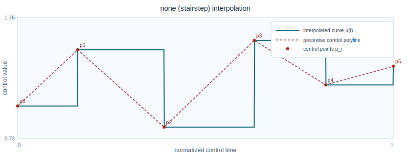 |
| `nearest` | 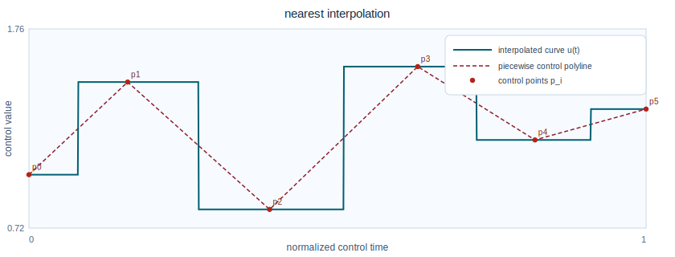 |
| `linear` | 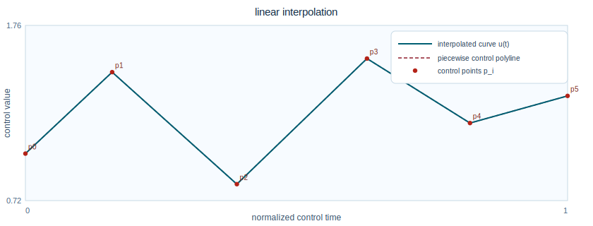 |
| `cubic` | 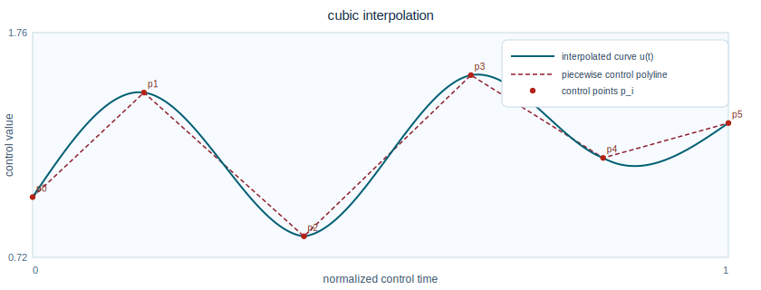 |
| `exponential` | 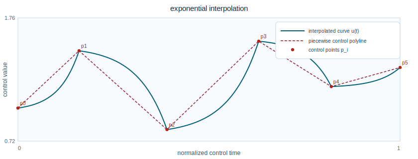 |
| `s_curve (smoothstep)` | 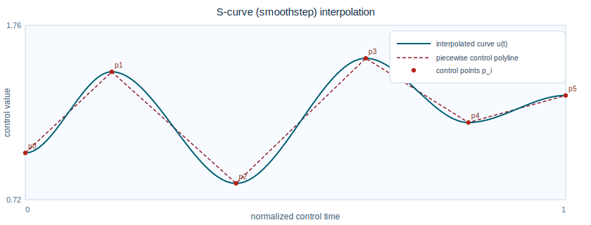 |
| `smootherstep` | 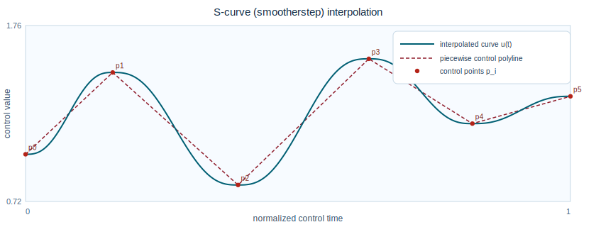 |
| `polynomial order 1` | 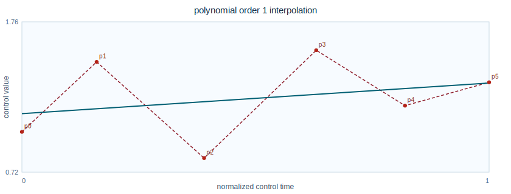 |
| `polynomial order 2` | 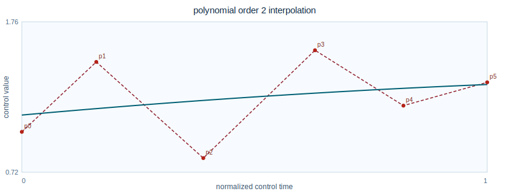 |
| `polynomial order 3` | 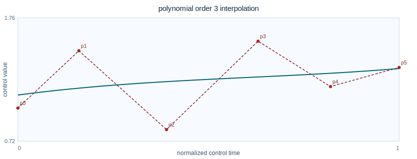 |
| `polynomial order 5` | 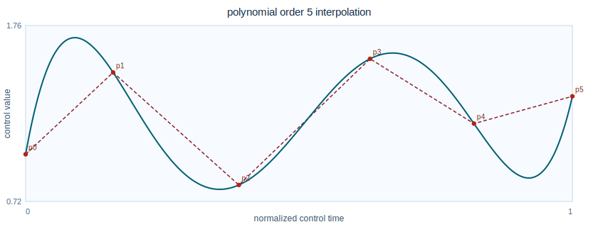 |

Core function graph gallery:

| Function family | Graph |
| --- | --- |
| Pitch ratio vs semitones | 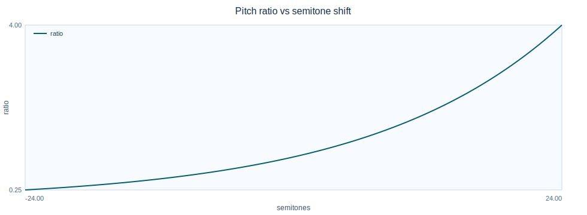 |
| Pitch ratio vs cents | 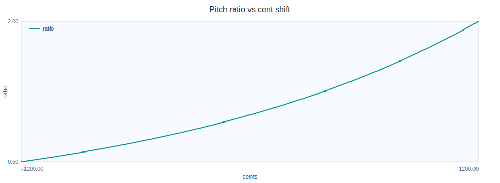 |
| Dynamics transfer curves | 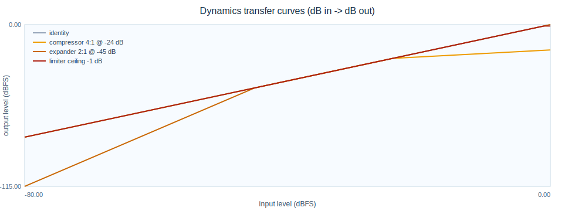 |
| Soft clip transfer functions | 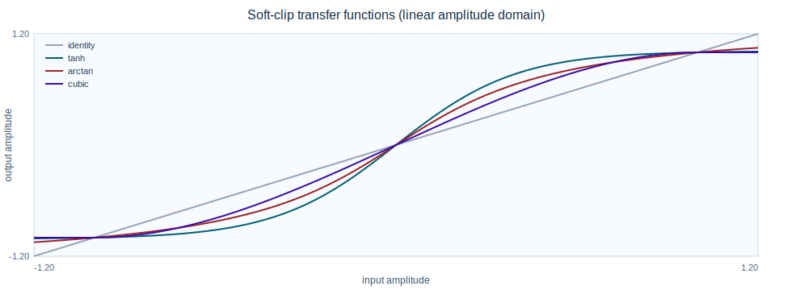 |
| Morph blend magnitude curves | 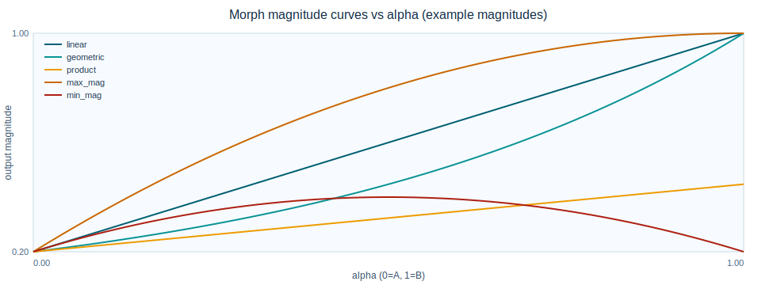 |
| Mask exponent response | 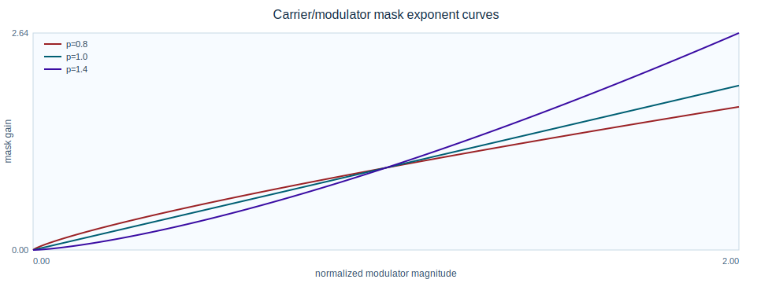 |
| Phase mix curve | 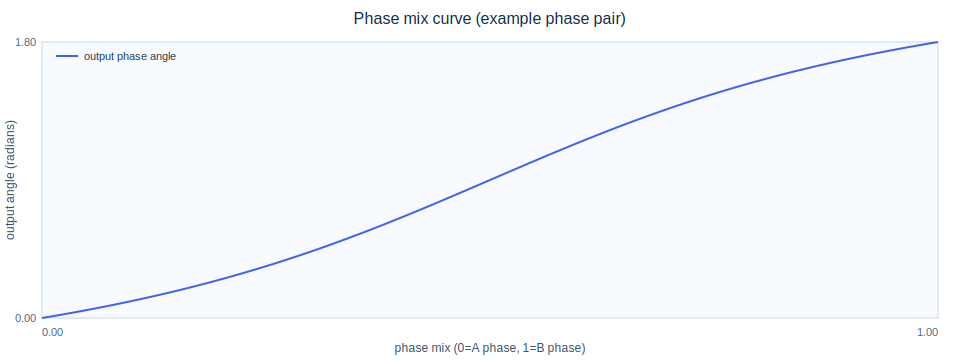 |

## What Is a Phase Vocoder? (No Math Version)

A phase vocoder is a way to process sound in very short overlapping slices.

For each slice:
1. It measures "how much of each frequency is present" and "where its phase is".
2. It modifies timing and/or pitch in that spectral representation.
3. It rebuilds audio from overlapping slices.

In short, you are taking audio apart, tidying it up, and putting it back together without pretending time is optional.

Why "phase" matters:
- If magnitudes are changed without consistent phase evolution, output can sound smeared, chorus-like, metallic, or unstable.
- Good phase handling keeps tones continuous across frames and improves naturalness.

In practical terms, `pvx` gives you controls for this quality layer:
- phase locking
- transient protection/hybrid modes
- stereo coherence modes
- formant-aware pitch workflows

## Analog Tape Methods for Pitch/Time Shifting

Before digital signal processing (DSP), classical tape varispeed linked time and pitch: speed tape up and pitch rises; slow it down and pitch falls. The central engineering problem was decoupling those two controls.

### Anton Springer before ELTRO (pre-commercial phase)

Before ELTRO-branded units became widely known, Anton Springer had already developed and demonstrated the core time/pitch regulation idea in the 1950s.

Practical timeline (pre-ELTRO):
- around 1950: early patent-era work focused on changing information rate while preserving intelligibility
- 1953: public demonstration of an acoustic speed/pitch regulator at the International Congress on Acoustics (Delft)
- 1950s to early 1960s: continued engineering/publication work (including German technical press such as *Funkschau*) on segmented rotating-head tape replay methods

Core mechanism:
- a rotating multi-head replay path processes short tape segments
- segment repeat/skip behavior controls duration and pitch more independently than fixed-head varispeed
- transition handling between segments determines perceived smoothness and artifact level

### ELTRO as commercialization phase

The ELTRO information rate changer can be viewed as the commercialization and operational packaging of that earlier Springer regulator lineage. Historically, this analog segmented-playback family is a direct ancestor of modern time-stretch/pitch-shift systems.

Two practical historical points still matter for `pvx`:
- Segment operations can create discontinuity artifacts if transitions are not handled carefully.
- Perceptual quality depends heavily on continuity constraints (in analog systems: segment stitching; in phase-vocoder systems: phase evolution, transient handling, and crossfades).

Wendy Carlos’ account of the Eltro Mark II also documents production use in film post work, including `2001: A Space Odyssey` voice treatment workflows where time and pitch manipulation were applied in controlled passes. That production history is a useful reminder that high-quality results usually come from methodical multi-stage processing, not one aggressive control move.

Sources:
- [Eltro information rate changer (Wikipedia)](https://en.wikipedia.org/wiki/Eltro_information_rate_changer)
- [Vintage Technologies: The Eltro and the Voice of HAL (Wendy Carlos)](https://www.wendycarlos.com/other/Eltro-1967/)
- [Anton Springer and the Time and Pitch Regulator (Sound and Science)](https://soundandscience.net/contributor-essays/anton-springer-and-the-time-and-pitch-regulator/)
- [Anton Springer, *Zeitraffung und -dehnung bei der Tonbandwiedergabe* (Funkschau archive entry)](https://soundandscience.net/texts/zeitraffung-und-dehnung-bei-der-tonbandwiedergabe/)

## Mental Model (1 Minute)

Input waveform -> short overlapping frames -> frequency-domain edit -> overlap-add resynthesis -> output waveform

Useful intuition:
- window size (`--n-fft` / `--win-length`) trades time detail vs frequency detail
- hop size (`--hop-size`) controls frame overlap density
- larger windows often help low-frequency tonal stability
- transient handling is important for drums/plosives/onsets

## 30-Second Quick Start

```bash
python3 -m venv .venv
source .venv/bin/activate
python3 -m pip install -e .
pvx voc input.wav --stretch 1.20 --output output.wav
```

Same quick start with `uv`:

```bash
uv venv .venv
source .venv/bin/activate
uv pip install -e .
uv run pvx voc input.wav --stretch 1.20 --output output.wav
```

If `pvx` is not found after install, add the virtualenv binaries to your shell path environment variable (`PATH`):

```bash
printf 'export PATH="%s/.venv/bin:$PATH"\n' "$(pwd)" >> ~/.zshrc
source ~/.zshrc
pvx --help
```

If you do not want to modify the path environment variable (`PATH`), run the same command through the repository wrapper:

```bash
.venv/bin/pvx voc input.wav --stretch 1.20 --output output.wav
# or
python3 -m pvx.cli.pvx voc input.wav --stretch 1.20 --output output.wav
```

Equivalent with `uv`:

```bash
uv run pvx voc input.wav --stretch 1.20 --output output.wav
```

What this does:
- reads `input.wav`
- stretches duration by 20%
- writes `output.wav`

Prefer installed commands (`pvx`, `pvxvoc`, `pvxfreeze`) for stable entry points.

With `uv`, run wrappers the same way:

```bash
uv run pvx voc input.wav --stretch 1.2 --output output.wav
uv run pvx freeze input.wav --freeze-time 0.25 --duration 8 --output freeze.wav
```

## Unified CLI (Primary Entry Point)

`pvx` is now the recommended command surface for first-time users.

```bash
pvx list
pvx help voc
pvx examples basic
pvx guided
pvx follow --example all
pvx chain --example
pvx stream --example
pvx stretch-budget --help
```

You can also use a convenience shortcut for the default vocoder path:

```bash
pvx input.wav --stretch 1.20 --output output.wav
```

This is equivalent to:

```bash
pvx voc input.wav --stretch 1.20 --output output.wav
```

## 5-Minute Tutorial (Single-File Workflow)

Use one file (`voice.wav`) and run three common operations.

1. Inspect available presets/examples:

```bash
pvx voc --example all
```

2. Time-stretch only:

```bash
pvx voc voice.wav --stretch 1.30 --output voice_stretch.wav
```

3. Pitch-shift only (duration unchanged):

```bash
pvx voc voice.wav --stretch 1.0 --pitch -3 --output voice_down3st.wav
```

4. Pitch-shift with formant preservation:

```bash
pvx voc voice.wav --stretch 1.0 --pitch -3 --pitch-mode formant-preserving --output voice_down3st_formant.wav
```

5. Quick A/B check:
- `voice_down3st.wav` should sound darker/slower-formant (“larger” vocal tract impression).
- `voice_down3st_formant.wav` should keep vowel identity more stable.

## Conceptual Overview: What Is a Phase Vocoder?

A phase vocoder uses the **short-time Fourier transform (STFT)** to repeatedly answer this question:
"What frequencies are present in this tiny time slice, and how do their phases evolve from one slice to the next?"

The core workflow is:
1. Split audio into overlapping frames.
2. Apply a window function to each frame.
3. Transform each frame into spectral bins (magnitude + phase).
4. Modify timing/pitch by controlling phase progression and synthesis hop.
5. Reconstruct audio by overlap-adding all processed frames.

If you are new to this, the key idea is that **phase continuity between frames** is what separates high-quality output from "phasiness" artifacts.

### 1) Analysis STFT

`pvx` analyzes each frame with:

$$
X_t[k] = \sum_{n=0}^{N-1} x[n+tH_a]w[n]e^{-j2\pi kn/N}
$$

where:
- $x[n]$ represents the input signal sample at index $n$
- $t$ represents frame index
- $k$ represents frequency-bin index
- $N$ represents frame size (`--n-fft`)
- $H_a$ represents analysis hop
- $w[n]$ represents the selected window (`--window`)

Plain-English meaning:
- each frame is windowed, then transformed
- output bin $X_t[k]$ is complex-valued (magnitude and phase)
- this gives the per-frame spectral state used by downstream processing

### 2) Phase-Vocoder Propagation

Time stretching is controlled by phase evolution:

$$
\Delta\phi_t[k] = \mathrm{princarg}(\phi_t[k]-\phi_{t-1}[k]-\omega_kH_a)
$$
$$
\hat\phi_t[k] = \hat\phi_{t-1}[k] + \omega_kH_s + \Delta\phi_t[k]
$$

where:
- $\phi_t[k]$ is observed phase at frame $t$, bin $k$
- $\hat\phi_t[k]$ is synthesized/output phase
- $\omega_k$ is nominal bin center frequency in radians/sample
- $H_s$ is synthesis hop (effective time-stretch control)
- $\mathrm{princarg}(\cdot)$ wraps phase to $(-\pi, \pi]$

Plain-English meaning:
- first estimate the true per-bin phase advance
- then re-accumulate phase using a new synthesis hop
- this lets duration change while preserving spectral continuity

### 3) Pitch Mapping

Pitch controls map musical intervals to ratio:

$$
r = 2^{\Delta s/12} = 2^{\Delta c/1200}
$$

where:
- $r$ is pitch ratio
- $\Delta s$ is semitone shift (`--pitch`)
- $\Delta c$ is cents shift (`--cents`)

Practical interpretation:
- $r > 1$: pitch up
- $r < 1$: pitch down
- formant options control whether vocal timbre shifts with pitch or is preserved

## When To Use Which Tool (Decision Tree)

```text
Start
 |
 +-- Need general time/pitch processing on one file or batch?
 |    -> pvx voc
 |
 +-- Need sustained spectral drone from one instant?
 |    -> pvx freeze
 |
 +-- Need stacked harmony voices from one source?
 |    -> pvx harmonize
 |
 +-- Need timeline-constrained pitch/time map from CSV?
 |    -> pvx conform / pvx warp
 |
 +-- Need morphing between two sources?
 |    -> pvx morph
 |
 +-- Need monophonic retune to scale/root?
 |    -> pvx retune
 |
 +-- Need denoise or dereverb cleanup?
      -> pvx denoise / pvx deverb
```

## Common Workflows

| Goal | Tool | Minimal command |
| --- | --- | --- |
| Vocal retune / timing correction | `pvx voc` | `pvx voc vocal.wav --preset vocal --stretch 1.05 --pitch -1 --output vocal_fix.wav` |
| Sound-design freeze pad | `pvx freeze` | `pvx freeze hit.wav --freeze-time 0.12 --duration 10 --output-dir out` |
| Tempo stretch with transient care | `pvx voc` | `pvx voc drums.wav --stretch 1.2 --transient-preserve --phase-locking identity --output drums_120.wav` |
| Harmonic layering | `pvx harmonize` | `pvx harmonize lead.wav --intervals 0,4,7 --gains 1,0.8,0.7 --output-dir out` |
| Cross-source morphing / cross-synthesis | `pvx morph` | `pvx morph a.wav b.wav --blend-mode carrier_a_envelope_b --alpha 0.7 --output morph.wav` |
| Phase-consistent denoising | `pvx denoise` / `pvx noisefilter` | `pvx denoise speech.wav --noise-seconds 0.4 --reduction-db 5 --smooth 9 --output speech_clean.wav` |
| AI dataset augmentation (deterministic) | `pvx augment` | `pvx augment data/*.wav --output-dir aug_out --variants-per-input 4 --intent asr_robust --seed 1337` |
| Build control envelope map | `pvx envelope` / `pvx lfo` | `pvx envelope --mode adsr --duration 8 --rate 20 --key stretch --output stretch_env.csv` |
| Build periodic LFO map (sine/triangle/square/saw) | `pvx lfo` | `pvx lfo --wave triangle --duration 8 --frequency-hz 0.5 --center 1.0 --amplitude 0.2 --key stretch --output stretch_lfo.csv` |
| Reshape control map | `pvx reshape` | `pvx reshape stretch_env.csv --key stretch --operation resample --rate 50 --interp polynomial --order 5 --output stretch_dense.csv` |

More complete examples and use-case playbooks (72+ runnable recipes): [docs/EXAMPLES.md](docs/EXAMPLES.md)
Wild experimentation pack (100 ideas): [docs/CRAZY_100.md](docs/CRAZY_100.md)

## Supported File Types

| Category | Supported types |
| --- | --- |
| Audio file input/output | All formats provided by the active `soundfile/libsndfile` build |
| Stream output (`--stdout`) | `wav`, `flac`, `aiff`/`aif`, `ogg`/`oga`, `caf` |
| Control maps | `csv`, `json` |
| Run manifests | `json` |
| Generated docs | `html`, `pdf` |

Full table of all currently supported audio container types: [docs/FILE_TYPES.md](docs/FILE_TYPES.md)

## Performance and GPU (Quality-First)

`pvx` is not tuned as a "fastest possible at any cost" engine. Duh: it's written in Python. Start from quality-safe defaults, validate artifact levels, then reduce runtime where acceptable.

### CPU path
- default path is robust and portable
- use power-of-two FFT sizes first (`1024`, `2048`, `4096`, `8192`) for stable transform behavior and good throughput

### CUDA path

```bash
pvx voc input.wav --device cuda --stretch 1.1 --output out_cuda.wav
```

Short aliases:
- `--gpu` means `--device cuda`
- `--cpu` means `--device cpu`

### Quality-First tuning checklist
- start with quality controls first: `--phase-locking identity`, transient protection, stereo coherence mode
- choose larger `--n-fft` when low-frequency clarity matters; only reduce `--n-fft` when quality remains acceptable
- use `--multires-fusion` when it audibly improves content; disable only if quality is unchanged
- after artifact checks, optimize runtime via `--auto-segment-seconds` + `--checkpoint-dir` + `--resume`

## CLI Discoverability and UX

`pvx` now provides a single command surface for discovery (`pvx list`, `pvx help <tool>`, `pvx examples`, `pvx guided`), while `pvxvoc` retains advanced controls for detailed phase-vocoder workflows.

Additional helper workflows:
- `pvx chain`: managed multi-stage chains without manually wiring per-stage `--stdout` / `-` plumbing
- `pvx stream`: stateful chunk engine for long-form streaming workflows (`--mode stateful` default, `--mode wrapper` compatibility fallback)
- `pvx stretch-budget`: estimate max safe stretch from an input file and disk budget before launching extreme renders
- `pvx augment`: deterministic augmentation dataset generation for machine-learning pipelines with JSONL/CSV manifests
- `pvx augment-manifest`: validate/merge/stats utilities for augmentation manifests

`pvx voc` includes beginner UX features:

- Intent presets:
  - Legacy: `--preset none|vocal|ambient|extreme`
  - New: `--preset default|vocal_studio|drums_safe|extreme_ambient|stereo_coherent`
- Example mode: `--example basic` (or `--example all`)
- Guided mode: `--guided` (interactive prompts)
- Grouped help sections for discoverability:
  - `I/O`, `Performance`, `Quality/Phase`, `Time/Pitch`, `Transients`, `Stereo`, `Output/Mastering`, `Debug`
- Beginner aliases:
  - `--stretch` -> `--time-stretch`
  - `--pitch` / `--semitones` -> `--pitch-shift-semitones`
  - `--cents` -> `--pitch-shift-cents`
  - `--ratio` -> `--pitch-shift-ratio`
  - `--out` -> `--output`
  - `--gpu` / `--cpu` -> device shortcut
- Common output consistency:
  - shared tools now accept explicit single-file output via `--output` / `--out` in addition to `--output-dir` + `--suffix`
- Script-local examples:
  - every major tool now prints copy-paste examples in `--help` (not only in the README)

Plan/debug aids:
- `--auto-profile`
- `--auto-transform`
- `--explain-plan`
- `--manifest-json`

New quality controls:
- Hybrid transient engine:
  - `--transient-mode off|reset|hybrid|wsola`
  - `--transient-sensitivity`
  - `--transient-protect-ms`
  - `--transient-crossfade-ms`
- Stereo/multichannel coherence:
  - `--stereo-mode independent|mid_side_lock|ref_channel_lock`
  - `--ref-channel`
  - `--coherence-strength`

Runtime metrics visibility:
- Unless `--silent` is used, pvx tools now print an ASCII metrics table for input/output audio
  - sample rate, channels, duration, peak/RMS/crest, DC offset, ZCR, clipping %, spectral centroid, 95% bandwidth
  - plus an input-vs-output comparison table with `input`, `output`, and `delta(out-in)` columns: SNR, SI-SDR, LSD, modulation distance, spectral convergence, envelope correlation, transient smear, loudness/true-peak, and stereo drift metrics

Output policy controls (shared across audio-output tools):
- `--bit-depth {inherit,16,24,32f}`
- `--dither {none,tpdf}` and `--dither-seed`
- `--true-peak-max-dbtp`
- `--metadata-policy {none,sidecar,copy}`
- `--subtype` remains available as explicit low-level override

## Announcement Readiness: Top 5 Complaints (and Fixes)

If you announce `pvx`, these are the most likely first-wave complaints and the built-in responses.

| Likely complaint | Code-level response | Documentation response |
| --- | --- | --- |
| “I installed it, but `pvx` is not found.” | `pvx doctor` checks virtual environment activity, `PATH`, and dependency status with concrete fix commands. | Install and troubleshooting sections now point to `pvx doctor` as first triage. |
| “There are too many flags; I don’t know where to start.” | `pvx quickstart` prints a minimal five-step launch sequence. | Quick-start sections and examples now include the same sequence. |
| “My first render sounds phasey/choppy.” | `pvx safe` wraps `pvx voc` with conservative quality-first defaults (`identity` phase locking, hybrid transient mode, stereo coherence controls). | Quality guidance and cookbook examples now include `pvx safe` first-pass usage. |
| “Do I have to use FFT/STFT only?” | `pvx transforms` prints transform options (`fft`, `dft`, `czt`, `dct`, `dst`, `hartley`) plus availability and recommendation guidance. | Transform guidance is now explicit and linked from command help and examples. |
| “How do I know this build is healthy before a demo?” | `pvx smoke` runs a fast synthetic end-to-end render and verifies output creation/readback. | Launch checklist now includes `pvx smoke` before public demos/releases. |

Launch checklist (copy/paste):

```bash
pvx doctor
pvx quickstart input.wav --output output.wav
pvx safe input.wav --material mix --output output_safe.wav
pvx transforms
pvx smoke --output smoke_out.wav
```

## AI Research and Data Augmentation

`pvx` now includes deterministic augmentation workflows for machine-learning and research datasets via `pvx augment`.

Key properties:
- deterministic generation with `--seed`
- repeatable train/validation/test assignment with `--split`
- split-leakage control via grouping:
  - `--grouping stem-prefix` (default)
  - `--group-separator "__"`
- optional balanced split assignment from label metadata:
  - `--split-mode label_balanced`
  - `--split-mode speaker_balanced`
  - `--labels-csv labels.csv`
- intent profiles tuned for common tasks:
  - `asr_robust` (automatic speech recognition robustness)
  - `mir_music` (music information retrieval)
  - `ssl_contrastive` (self-supervised contrastive augmentation)
- paired contrastive view mode: `--pair-mode contrastive2`
- label perturbation policy: `--label-policy preserve|allow_alter`
- policy files for reproducible settings: `--policy augment_policy.json`
- deterministic parallel rendering with resume support:
  - `--workers N`
  - `--resume`
  - `--append-manifest`
- provenance fields in manifest: `source_sha256`, `output_sha256`
- optional per-output audit metrics in manifest: peak/rms/clip/zero-crossing
- manifest outputs for reproducibility/audit:
  - JSON Lines (JSONL): default `augment_manifest.jsonl`
  - comma-separated values (CSV): default `augment_manifest.csv`

Command examples:

```bash
# Speech-focused augmentation set
pvx augment data/speech/*.wav --output-dir aug/speech --variants-per-input 6 --intent asr_robust --seed 1337

# Music-focused augmentation set with custom split ratios
pvx augment data/music/*.wav --output-dir aug/music --variants-per-input 4 --intent mir_music --split 0.7,0.2,0.1 --seed 2026

# Dry-run planning only (no audio renders, manifest only)
pvx augment data/*.wav --output-dir aug/plan --variants-per-input 3 --intent ssl_contrastive --dry-run --seed 42

# Balanced split assignment by speaker metadata
pvx augment data/*.wav --output-dir aug/speaker_bal --variants-per-input 3 --intent asr_robust --split-mode speaker_balanced --labels-csv labels.csv --seed 42

# Resume interrupted runs and append to existing manifest
pvx augment data/*.wav --output-dir aug/resume --variants-per-input 4 --intent mir_music --resume --append-manifest --seed 2026

# Manifest validation and merge tools
pvx augment-manifest validate aug/resume/augment_manifest.jsonl --strict
pvx augment-manifest merge aug/run_a/augment_manifest.jsonl aug/run_b/augment_manifest.jsonl --output-jsonl aug/merged_manifest.jsonl --output-csv aug/merged_manifest.csv

# Augmentation profile benchmark suite and gates (speech/music/noisy/stereo)
python benchmarks/run_augment_profile_suite.py --quick --gate --out-dir benchmarks/out_augment_profiles

# Refresh per-profile baselines after intentional benchmark changes
python benchmarks/run_augment_profile_suite.py --quick --refresh-baselines --out-dir benchmarks/out_augment_profiles_refresh
```

See full guide: [docs/AI_AUGMENTATION.md](docs/AI_AUGMENTATION.md)

## Benchmarking (pvx vs Rubber Band vs librosa)

Run a tiny benchmark (cycle-consistency metrics):

```bash
python3 benchmarks/run_bench.py --quick --out-dir benchmarks/out
```

With `uv`:

```bash
uv run python3 benchmarks/run_bench.py --quick --out-dir benchmarks/out
```

This uses the tuned deterministic profile by default (`--pvx-bench-profile tuned`).
Use `--pvx-bench-profile legacy` to compare against the prior pvx benchmark settings.

Stage 2 reproducibility controls:
- corpus manifest + hash validation: `--dataset-manifest`, `--strict-corpus`, `--refresh-manifest`
- deterministic CPU checks: `--deterministic-cpu`, `--determinism-runs`
- stronger gates: `--gate-row-level`, `--gate-signatures`
- automatic quality diagnostics are emitted in [benchmarks/out/report.md](benchmarks/out/report.md) and `report.json`

Interpret benchmark priorities:
- quality metrics are primary acceptance criteria
- runtime is tracked as a secondary engineering metric

Reported metrics now include:
- LSD, modulation spectrum distance, transient smear, stereo coherence drift
- SNR, SI-SDR, spectral convergence, envelope correlation
- RMS delta, crest-factor delta, bandwidth(95%) delta, ZCR delta, DC delta, clipping-ratio delta
- Perceptual/intelligibility: PESQ, STOI, ESTOI, ViSQOL MOS-LQO, POLQA MOS-LQO, PEAQ ODG
- Loudness/mastering: integrated LUFS delta, short-term LUFS delta, LRA delta, true-peak delta
- Pitch/harmonic: F0 RMSE (cents), voicing F1, HNR drift
- Transient timing: onset precision/recall/F1, attack-time error
- Spatial/stereo: ILD drift, ITD drift, inter-channel phase deviation (low/mid/high/mean)
- Artifact-focused: phasiness index, musical-noise index, pre-echo score

Notes:
- Some perceptual standards require external/proprietary tools. When unavailable, pvx reports deterministic proxy estimates and includes a `Proxy Fraction` in benchmark markdown.
- External hooks are supported via environment variables:
  - `VISQOL_BIN`
  - `POLQA_BIN`
  - `PEAQ_BIN`

Run with regression gate against committed baseline:

```bash
python3 benchmarks/run_bench.py --quick --out-dir benchmarks/out --strict-corpus --determinism-runs 2 --baseline benchmarks/baseline_small.json --gate --gate-row-level --gate-signatures
```

`uv` equivalent:

```bash
uv run python3 benchmarks/run_bench.py --quick --out-dir benchmarks/out --strict-corpus --determinism-runs 2 --baseline benchmarks/baseline_small.json --gate --gate-row-level --gate-signatures
```

PVC-style parity benchmark for phase 3-7 operators:

```bash
python3 benchmarks/run_pvc_parity.py --quick --out-dir benchmarks/out_pvc_parity --baseline benchmarks/baseline_pvc_parity.json --gate --gate-tolerance 0.20
```

`uv` equivalent:

```bash
uv run python3 benchmarks/run_pvc_parity.py --quick --out-dir benchmarks/out_pvc_parity --baseline benchmarks/baseline_pvc_parity.json --gate --gate-tolerance 0.20
```

## Visual Documentation

See [docs/DIAGRAMS.md](docs/DIAGRAMS.md) for:
- expanded architecture and DSP atlas (Mermaid + ASCII)
- quality-first tuning and metrics-flow diagrams
- STFT analysis/resynthesis timelines
- phase propagation and phase-locking diagrams
- hybrid transient/WSOLA/stitching diagrams
- stereo coherence mode diagrams
- map/segment and checkpoint/resume diagrams
- benchmark and CI gate flow diagrams
- mastering chain and troubleshooting decision trees

## Troubleshooting

### “No readable input files matched…”
- verify path and extension
- quote globs in shells if needed
- run `pvx guided` (or `pvx voc --guided`)

### Output sounds “phasier” or “smear-y”
- enable `--phase-locking identity`
- enable `--transient-preserve`
- reduce stretch ratio, or use `--stretch-mode multistage`

### Freeze output flutters instead of sounding stationary
- use `pvx freeze ... --phase-mode instantaneous` (default; best for stable holds)
- if you want explicit bin-center stepping, use `--phase-mode bin`
- use `--phase-mode hold` only for deliberately static/experimental phase behavior

### Speech sounds robotic after pitch shift
- use `--pitch-mode formant-preserving`
- reduce semitone magnitude
- increase overlap (`--hop-size` smaller relative to `--win-length`)

### Denoise sounds chirpy or watery
- reduce `--reduction-db` (for example from `8` to `5`)
- increase `--smooth` by `2` to `4` frames
- increase `--floor` slightly (for example `0.1` to `0.2`)
- if possible, use `--noise-file` with clean room tone instead of inferred leading-noise estimation

### CUDA requested but falls back
- ensure CuPy install matches your CUDA runtime
- test with `--device cuda` to force explicit failure if unavailable

### Long extreme render interrupted
- rerun with `--checkpoint-dir ... --resume`
- consider `--auto-segment-seconds 0.25` to reduce recompute scope

### I need a massive stretch ratio (for example 1,000,000x)
- run a budget estimate first so you do not launch an impossible render:
  - `pvx stretch-budget input.wav --disk-budget 20GB --bit-depth 16 --requested-stretch 1000000`
- for script/CI gating, fail early if request exceeds budget:
  - `pvx stretch-budget input.wav --disk-budget 20GB --requested-stretch 1000000 --fail-if-exceeds --json`
- if you proceed, prefer:
  - `--target-duration` over arbitrary giant ratios
  - `--stretch-mode multistage`
  - `--auto-segment-seconds` + `--checkpoint-dir` + `--resume`

## FAQ

### Can pvx time-stretch and time-compress?
Yes. `--stretch > 1` lengthens, `--stretch < 1` shortens.

### Can I shift pitch without changing duration?
Yes. Use pitch flags with `--stretch 1.0`, e.g. `--pitch`, `--cents`, or `--ratio`.

### Can I use the phase-vocoder path for denoising?
Yes. Use `pvx denoise` for phase-consistent short-time Fourier transform (STFT) spectral subtraction, or `pvx noisefilter` with a reusable response profile.

```bash
# Speech-safe denoise (conservative)
pvx denoise speech.wav --noise-seconds 0.4 --reduction-db 5 --floor 0.2 --smooth 9 --output speech_clean.wav

# Music-safe denoise (retain ambience/harmonics)
pvx denoise mix.wav --noise-seconds 0.3 --reduction-db 4 --floor 0.25 --smooth 7 --output mix_clean.wav

# Denoise then stretch in one pipe
pvx denoise noisy.wav --reduction-db 6 --stdout | pvx voc - --stretch 2.0 --output clean_stretch.wav
```

### I installed pvx but get `zsh: command not found: pvx`. What now?
Use one of these immediately:

```bash
.venv/bin/pvx --help
# or
python3 -m pvx.cli.pvx --help
```

Then either keep using one of those forms or add `.venv/bin` to your path environment variable (`PATH`):

```bash
printf 'export PATH="%s/.venv/bin:$PATH"\n' "$(pwd)" >> ~/.zshrc
source ~/.zshrc
```

### What is an `.npz` file in pvx?
`.npz` is NumPy's compressed container format. In `pvx` it stores reusable analysis/response artifacts:
- `.pvxan.npz`: short-time Fourier transform (STFT) analysis payloads
- `.pvxrf.npz`: derived frequency-response payloads

These files are binary, compact, and intended for machine reuse in repeatable pipelines.

### Can I chain tools in one shell line?
Yes. Use `--stdout` and `-` input on downstream tools.

For shorter one-liners without manual pipe wiring, use managed chain mode:

```bash
pvx chain input.wav --pipeline "voc --stretch 1.2 | formant --mode preserve" --output output_chain.wav
```

For chunked long renders through the default stateful stream engine:

```bash
pvx stream input.wav --output output_stream.wav --chunk-seconds 0.2 --time-stretch 3.0
```

Compatibility fallback (legacy segmented-wrapper behavior):

```bash
pvx stream input.wav --mode wrapper --output output_stream.wav --chunk-seconds 0.2 --time-stretch 3.0
```

### Can I generate many random variants in one command?
Yes. Use `--lucky N` on processing workflows:

```bash
pvx voc input.wav --output-dir out --lucky 12
pvx freeze input.wav --output-dir out --lucky 8 --lucky-seed 42
pvx chain input.wav --pipeline "voc --stretch 1.5 | deverb --strength 0.4" --output out/chain.wav --lucky 5
```

### Can I reverberate a mono file with a 4-channel impulse response and move source position from A to B?
Yes. Use `pvx trajectory-reverb` with cartesian or spherical coordinates:

```bash
# Cartesian trajectory
pvx trajectory-reverb source.wav --ir room_4ch.wav \
  --coord-system cartesian --start -1,0,1 --end 1,0,1 \
  --trajectory-shape ease-in-out --output flythrough_cart.wav

# Spherical trajectory (azimuth,elevation,radius)
pvx trajectory-reverb source.wav --ir room_4ch.wav \
  --coord-system spherical --start -90,0,1.2 --end 90,0,1.2 \
  --output flythrough_sph.wav
```

Optional explicit speaker layout (azimuth,elevation per channel):

```bash
pvx trajectory-reverb source.wav --ir room_4ch.wav \
  --speaker-angles "-45,0;45,0;135,0;-135,0" \
  --start -1,0,1 --end 1,0,1 --output flythrough_layout.wav
```

```bash
pvx voc input.wav --stretch 1.1 --stdout \
  | pvx denoise - --reduction-db 10 --stdout \
  | pvx deverb - --strength 0.4 --output cleaned.wav
```

### Can I route control maps in pipes without `awk`?
Yes. The shortest path is the one-command helper:

```bash
pvx follow A.wav B.wav --output B_follow.wav --emit pitch_to_stretch --pitch-conf-min 0.75
```

Under the hood, this runs pitch tracking on `A.wav`, emits a control map, and feeds it to `pvx voc` on `B.wav`.

Manual pipe form is still available for explicit control-bus routing:

Pitch-to-stretch sidechain:

```bash
pvx pitch-track A.wav --emit pitch_to_stretch --output - \
  | pvx voc B.wav --control-stdin --output B_follow.wav
```

Explicit route example (map `pitch_ratio` -> `stretch`, force `pitch_ratio` to unity):

```bash
pvx pitch-track A.wav --output - \
  | pvx voc B.wav --control-stdin --route stretch=pitch_ratio --route pitch_ratio=const(1.0) --output B_time_follow.wav
```

### Can I generate LFOs from the command line (sine/triangle/ramp/square/saw)?
Yes. Use `pvx lfo` (alias for `pvx envelope`) and select `--wave`:

```bash
# Triangle LFO using frequency in Hz
pvx lfo --wave triangle --duration 8 --frequency-hz 0.5 --center 1.0 --amplitude 0.2 --key stretch --output stretch_tri.csv

# Sine LFO using cycle count over clip duration
pvx lfo --wave sine --duration 12 --cycles 6 --center 1.0 --amplitude 0.25 --key stretch --output stretch_sine.csv

# Square LFO with duty cycle
pvx lfo --wave square --duration 8 --frequency-hz 2.0 --center 1.0 --amplitude 0.3 --duty-cycle 0.35 --key pitch_ratio --output pitch_square.csv

# Ramp envelope (non-periodic)
pvx lfo --wave ramp --duration 6 --start 1.0 --end 0.5 --key stretch --output stretch_ramp.csv
```

Then apply with control-bus routing:

```bash
pvx voc input.wav --stretch stretch_tri.csv --interp linear --output out.wav
```

### How large can stretch get before it becomes impractical?
Use:

```bash
pvx stretch-budget input.wav --disk-budget 20GB --bit-depth 16 --json
```

This estimates the maximum safe stretch from:
- input frames/channels/sample rate
- assumed output format + subtype/bit depth
- available budget (`--disk-budget` or free space at `--budget-path`)
- safety headroom (`--safety-margin`, default `0.90`)

You can also ask whether a requested ratio fits:

```bash
pvx stretch-budget input.wav --disk-budget 20GB --requested-stretch 1000000 --fail-if-exceeds
```

`pvx pitch-track` can now emit a broad feature vector for control-map routing, including:
- pitch and voicing: `f0_hz`, `pitch_ratio`, `confidence`, `voicing_prob`, `pitch_stability`, `note_boundary`
- loudness/dynamics: `rms`, `rms_db`, `short_lufs_db`, `crest_factor_db`, `clip_ratio`, `transientness`
- spectral shape: `spectral_centroid_hz`, `spectral_spread_hz`, `spectral_flatness`, `spectral_flux`, `rolloff_hz`
- timbre/descriptors: `mfcc_01..mfcc_N`, `formant_f1_hz..formant_f3_hz`, `harmonic_ratio`, `inharmonicity`
- rhythm: `tempo_bpm`, `beat_phase`, `downbeat_phase`, `onset_strength`, `transient_mask`
- stereo/noise/artifact proxies: `ild_db`, `itd_ms`, `hum_50_ratio`, `hum_60_ratio`, `hiss_ratio`
- MPEG-7-style descriptors: `mpeg7_*` columns including centroid/spread/flatness/flux/rolloff/attack-time/temporal-centroid and coarse audio spectrum envelope bands.

Feature-routing examples:

```bash
# MFCC-driven pitch modulation on B
pvx pitch-track A.wav --feature-set all --mfcc-count 13 --output - \
  | pvx voc B.wav --control-stdin --route pitch_ratio=affine(mfcc_01,0.002,1.0) --route pitch_ratio=clip(pitch_ratio,0.5,2.0) --output B_mfcc_pitch.wav

# MPEG-7 spectral flux drives stretch with clipping
pvx pitch-track A.wav --feature-set all --output - \
  | pvx voc B.wav --control-stdin --route stretch=affine(mpeg7_spectral_flux,0.05,1.0) --route stretch=clip(stretch,0.8,1.6) --route pitch_ratio=const(1.0) --output B_flux_stretch.wav
```

Expanded cookbook with many more single-feature, multi-feature, feature-vector, and multi-guide recipes:

- [`docs/FEATURE_SIDECHAIN_EXAMPLES.md`](docs/FEATURE_SIDECHAIN_EXAMPLES.md)

Built-in `pvx follow` example printer:

```bash
pvx follow --example
pvx follow --example all
pvx follow --example mfcc_flux
```

### Does pvx support microtonal workflows?
Yes. Use ratio/cents/semitone controls and CSV map modes, plus `pvx retune --scale-cents`,
`--a4-reference-hz`, `--root-hz`, or `--recommend-root`.

### Is every algorithm phase-vocoder-based?
No. The repo includes non-phase-vocoder modules too (analysis, denoise, dereverb, decomposition, etc.).

## Why This Matters

### How pvx differs from `librosa` and Rubber Band
- `librosa` is a broad analysis library; pvx is an operational CLI toolkit with research- and production-oriented pipelines, shared mastering chain, map-based automation, and extensive command-line workflows.
- Rubber Band is a strong dedicated stretcher; pvx emphasizes inspectable Python implementations, explicit transform/window control, CSV-driven control maps, integrated multi-tool workflows, and a quality-first tuning philosophy.

### Why phase coherence matters
Unconstrained phase across bins/frames causes audible blur, chorus-like instability, and transient damage. Phase locking and transient-aware logic reduce these failures.

### When transient preservation matters
Most for drums, consonants, plosives, and percussive attacks. Less critical for smooth pads and static drones.

### When NOT to use a phase vocoder
- strong transient-critical material with very large ratio changes may prefer waveform/granular strategies
- extremely low-latency live paths may prefer simpler time-domain methods
- if your target is artifact-heavy texture, stochastic engines may be preferable to strict phase coherence

## Lessons from Paul Koonce's PVC Package

Two useful historical references:
- Paul Koonce PVC page: [https://www.cs.princeton.edu/courses/archive/spr99/cs325/koonce.html](https://www.cs.princeton.edu/courses/archive/spr99/cs325/koonce.html)
- Linux Audio PVC catalog entry: [https://wiki.linuxaudio.org/apps/all/pvc](https://wiki.linuxaudio.org/apps/all/pvc)

What translates well into modern `pvx`:

| PVC idea | Why it still matters | How `pvx` uses or extends it |
| --- | --- | --- |
| Tool-per-task command design (`plainpv`, `twarp`, `harmonizer`, etc.) | Keeps workflows composable and scriptable | `pvx` subcommands (`voc`, `freeze`, `harmonize`, `conform`, `retune`, `morph`, `analysis`, `response`, ...) plus `pvx chain` |
| Command help as a first-class UX surface | Beginners discover flags faster from terminal help than docs | `pvx --help`, grouped flag sections, `--example`, `--guided`, and script-level example blocks |
| Dynamic parameter control from external data files | Real workflows need time-varying control, not static knobs | Per-parameter CSV/JSON control-rate signals with interpolation (`none`, `linear`, `nearest`, `cubic`, `exponential`, `s_curve`, `smootherstep`, `polynomial`) |
| Shell-script driven reproducibility | Repeatable runs matter for research and production | Copy-paste recipes, `pvx examples`, benchmark scripts, JSON manifests, and deterministic CPU mode |
| Explicit defaults shown in help | Makes behavior predictable and debuggable | Shared defaults + output policy + ASCII metric tables for every non-silent run |
| Analysis/synthesis experimentation mindset | Quality work needs inspectable internals and comparisons | Transform selection (`fft`, `dft`, `czt`, `dct`, `dst`, `hartley`) and benchmark gates vs baselines |

Practical next steps inspired by PVC tradition:
- keep every new tool runnable from one command without hidden state
- keep dynamic-control file formats simple and text-editable
- prefer transparent defaults and explicit artifact tradeoffs over black-box presets
- keep docs and `--help` synchronized so terminal users are not forced into source code

Sorted roadmap for additional top-level `pvx` commands (highest implementation return on investment first):

| Phase | Priority | Proposed commands | Why this phase comes first |
| --- | --- | --- | --- |
| Phase 1 | Highest | `doctor`, `inspect`, `validate`, `schema`, `preset`, `config` | Removes onboarding/debug friction and makes workflows self-describing before adding more DSP complexity. |
| Phase 2 | High | `render`, `graph`, `queue`, `watch`, `cache` | Makes long runs and iterative workflows practical for real projects. |
| Phase 3 | Medium-High | `mod`, `derive`, `route`, `quantize`, `smooth` | Expands control-rate signal design so dynamic parameter workflows become concise and repeatable. |
| Phase 4 | Medium | `bench`, `compare`, `regress`, `abx`, `report` | Turns quality claims into measurable quality gates and release criteria. |
| Phase 5 | Medium-Low | `align`, `match`, `stem`, `spatialize`, `live`, `serve` | Adds advanced production and deployment workflows once foundations are stable. |

Roadmap sort key:
- primary: user impact on quality-first workflows
- secondary: implementation complexity and dependency risk
- tertiary: leverage across multiple existing tools (`voc`, `retune`, `morph`, `freeze`, and wrappers)

## Progressive Documentation Map

Complete Markdown documentation list (all `.md` documentation files):

- [docs/ALGORITHM_LIMITATIONS.md](docs/ALGORITHM_LIMITATIONS.md)
- [docs/AI_AUGMENTATION.md](docs/AI_AUGMENTATION.md)
- [docs/API_OVERVIEW.md](docs/API_OVERVIEW.md)
- [docs/ARCHITECTURE.md](docs/ARCHITECTURE.md)
- [docs/BENCHMARKS.md](docs/BENCHMARKS.md)
- [docs/CITATION_QUALITY.md](docs/CITATION_QUALITY.md)
- [docs/CLI_FLAGS_REFERENCE.md](docs/CLI_FLAGS_REFERENCE.md)
- [docs/CRAZY_100.md](docs/CRAZY_100.md)
- [docs/DEV_NOTES.md](docs/DEV_NOTES.md)
- [docs/DIAGRAMS.md](docs/DIAGRAMS.md)
- [docs/DOCS_CONTRACT.md](docs/DOCS_CONTRACT.md)
- [docs/EXAMPLES.md](docs/EXAMPLES.md)
- [docs/FEATURE_SIDECHAIN_EXAMPLES.md](docs/FEATURE_SIDECHAIN_EXAMPLES.md)
- [docs/FILE_TYPES.md](docs/FILE_TYPES.md)
- [docs/FOLLOW_MIGRATION.md](docs/FOLLOW_MIGRATION.md)
- [docs/GETTING_STARTED.md](docs/GETTING_STARTED.md)
- [docs/HOW_TO_REVIEW.md](docs/HOW_TO_REVIEW.md)
- [docs/MATHEMATICAL_FOUNDATIONS.md](docs/MATHEMATICAL_FOUNDATIONS.md)
- [docs/PHASINESS_IMPLEMENTATION_PLAN.md](docs/PHASINESS_IMPLEMENTATION_PLAN.md)
- [docs/PIPELINE_COOKBOOK.md](docs/PIPELINE_COOKBOOK.md)
- [docs/PVC_LESSONS.md](docs/PVC_LESSONS.md)
- [docs/PVC_PARITY_MATRIX.md](docs/PVC_PARITY_MATRIX.md)
- [docs/PVC_PHASE3_5_ARCHITECTURE.md](docs/PVC_PHASE3_5_ARCHITECTURE.md)
- [docs/PVC_PHASE6_7_ARCHITECTURE.md](docs/PVC_PHASE6_7_ARCHITECTURE.md)
- [docs/PVX_ALGORITHM_PARAMS.md](docs/PVX_ALGORITHM_PARAMS.md)
- [docs/PYTHON_FILE_HELP.md](docs/PYTHON_FILE_HELP.md)
- [docs/QUALITY_GUIDE.md](docs/QUALITY_GUIDE.md)
- [docs/RUBBERBAND_COMPARISON.md](docs/RUBBERBAND_COMPARISON.md)
- [docs/WINDOW_REFERENCE.md](docs/WINDOW_REFERENCE.md)
- [docs/html/README.md](docs/html/README.md)
- [docs/q.md](docs/q.md)

Complete HyperText Markup Language (HTML) documentation list (all `.html` documentation files):

- [docs/index.html](docs/index.html)
- [docs/html/index.html](docs/html/index.html)
- [docs/html/architecture.html](docs/html/architecture.html)
- [docs/html/benchmarks.html](docs/html/benchmarks.html)
- [docs/html/citations.html](docs/html/citations.html)
- [docs/html/cli_flags.html](docs/html/cli_flags.html)
- [docs/html/cookbook.html](docs/html/cookbook.html)
- [docs/html/glossary.html](docs/html/glossary.html)
- [docs/html/limitations.html](docs/html/limitations.html)
- [docs/html/math.html](docs/html/math.html)
- [docs/html/papers.html](docs/html/papers.html)
- [docs/html/windows.html](docs/html/windows.html)
- [docs/html/groups/analysis_qa_and_automation.html](docs/html/groups/analysis_qa_and_automation.html)
- [docs/html/groups/creative_spectral_effects.html](docs/html/groups/creative_spectral_effects.html)
- [docs/html/groups/denoise_and_restoration.html](docs/html/groups/denoise_and_restoration.html)
- [docs/html/groups/dereverb_and_room_correction.html](docs/html/groups/dereverb_and_room_correction.html)
- [docs/html/groups/dynamics_and_loudness.html](docs/html/groups/dynamics_and_loudness.html)
- [docs/html/groups/granular_and_modulation.html](docs/html/groups/granular_and_modulation.html)
- [docs/html/groups/pitch_detection_and_tracking.html](docs/html/groups/pitch_detection_and_tracking.html)
- [docs/html/groups/retune_and_intonation.html](docs/html/groups/retune_and_intonation.html)
- [docs/html/groups/separation_and_decomposition.html](docs/html/groups/separation_and_decomposition.html)
- [docs/html/groups/spatial_and_multichannel.html](docs/html/groups/spatial_and_multichannel.html)
- [docs/html/groups/spectral_time_frequency_transforms.html](docs/html/groups/spectral_time_frequency_transforms.html)
- [docs/html/groups/time_scale_and_pitch_core.html](docs/html/groups/time_scale_and_pitch_core.html)

Portable Document Format (PDF) bundle:
- `docs/pvx_documentation.pdf`

## Community and Governance

- Contributing guide: [CONTRIBUTING.md](CONTRIBUTING.md)
- Code of conduct: [CODE_OF_CONDUCT.md](CODE_OF_CONDUCT.md)
- Security policy: [SECURITY.md](SECURITY.md)
- Support guidance: [SUPPORT.md](SUPPORT.md)
- Release process: [RELEASE.md](RELEASE.md)

## License

MIT

## Attribution

Copyright (c) 2026 Colby Leider and contributors. See [ATTRIBUTION.md](ATTRIBUTION.md).
