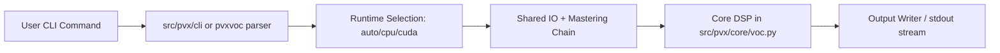
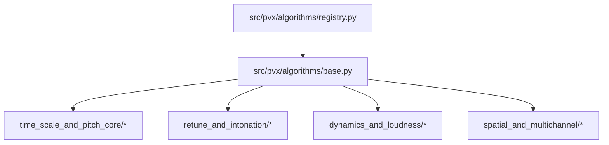
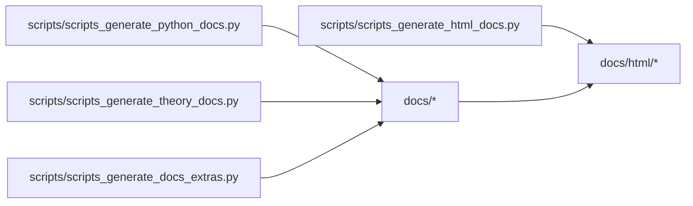
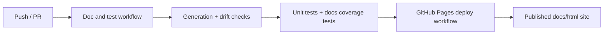

# pvx Architecture

_Generated from commit `cd4e579` (commit date: 2026-03-01T19:15:37-05:00)._

System architecture for runtime processing, algorithm dispatch, and documentation pipelines.

## 1. Runtime and CLI Flow

## 2. Algorithm Registry and Dispatch

## 3. Documentation Build Graph

## 4. CI + Pages

## Attribution

Copyright (c) 2026 Colby Leider and contributors. See [`ATTRIBUTION.md`](../ATTRIBUTION.md).
