<p align="center"></p>

# pvx Diagram Atlas


This document provides expanded architecture and digital signal processing (DSP) flow diagrams for pvx.
Diagrams are a mix of Mermaid (GitHub-rendered) and ASCII (terminal-friendly).

## 1) End-to-End pvxvoc Flow

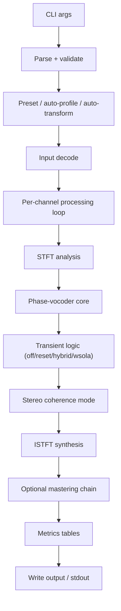

## 2) STFT Analysis / Synthesis Timeline

```text
signal: x[n] -------------------------------------------------------------->

windows:
          |----N----|
               |----N----|
                    |----N----|
hop:          <---Ha--->

analysis:
  frame t0 -> FFT -> X0[k]
  frame t1 -> FFT -> X1[k]
  frame t2 -> FFT -> X2[k]

processing:
  magnitude trajectory + phase trajectory updates

synthesis:
  IFFT(frame0), IFFT(frame1), IFFT(frame2) + overlap-add with Hs
```

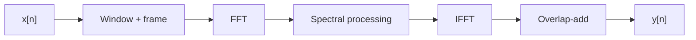

## 3) Phase Propagation and Locking

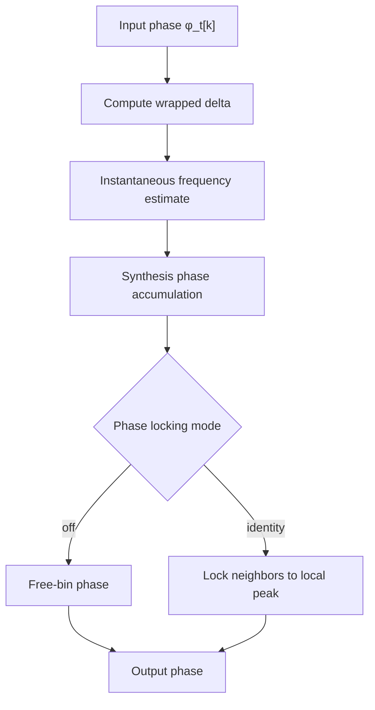

```text
Frame index:    t0      t1      t2      t3
Peak bin:       O-------O-------O-------O
Neighbor free:  o--o------o---o-----o-----   (drift can increase blur)
Neighbor lock:  o-------o-------o-------o     (relative peak shape preserved)
```

## 4) Hybrid Transient Engine

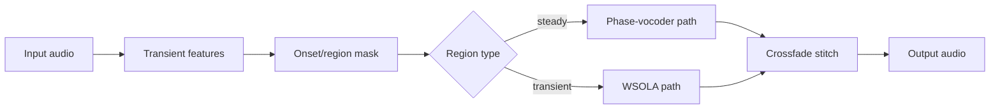

```text
time ------------------------------------------------------------>
mask 000000111100000011110000000
     steady^^^trans^^steady^^trans^^steady
```

## 5) Transient Feature Stack

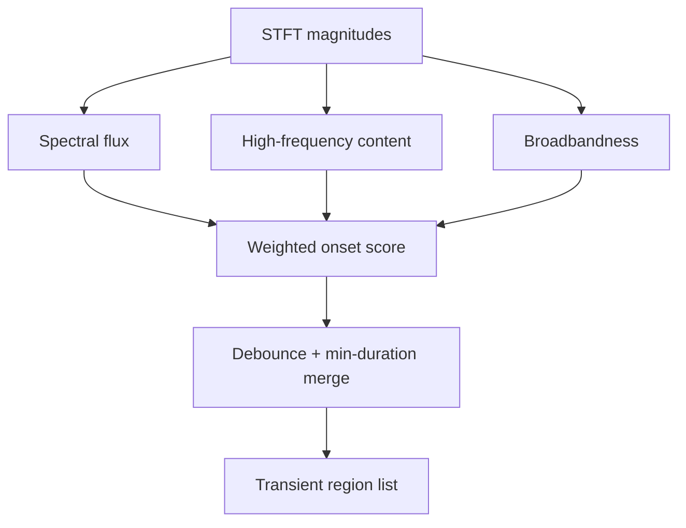

## 6) WSOLA Similarity Search

```text
reference analysis frame:      [========R========]

candidate search window:
                         [c0][c1][c2][c3][c4][c5][c6]
                           \    \    \    \    \    \
similarity score:           s0   s1   s2   s3   s4   s5

choose argmax(similarity) -> best offset -> overlap-add with crossfade
```

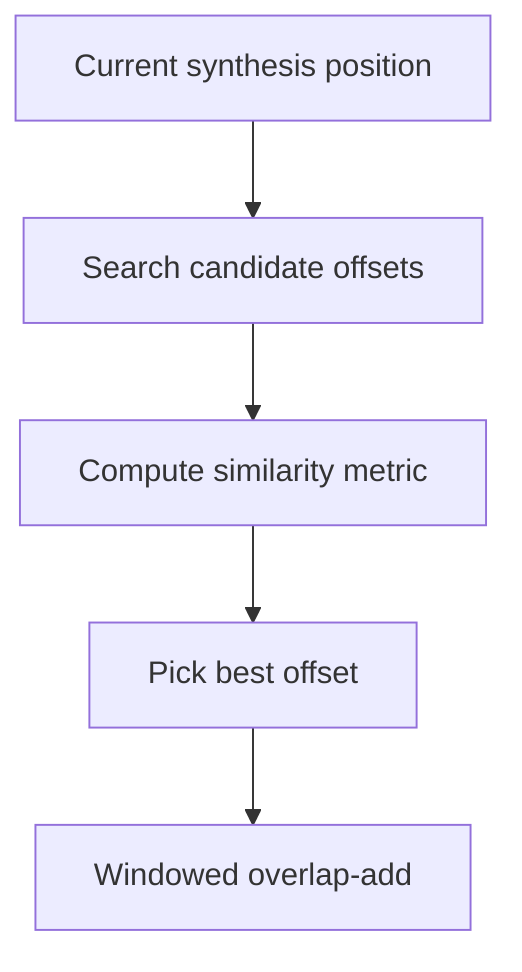

## 7) Stereo / Multichannel Coherence Modes

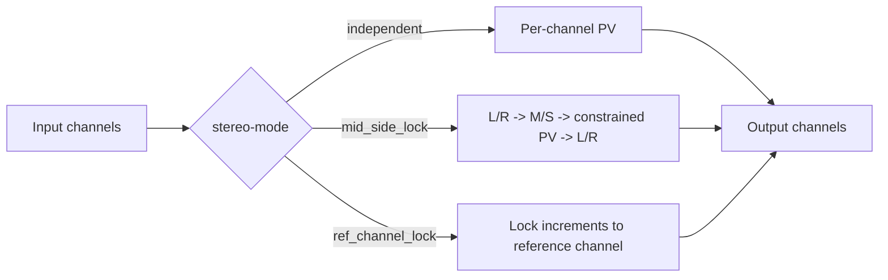

```text
independent:      L and R evolve freely
mid_side_lock:    preserve center/side coherence envelope
ref_channel_lock: keep phase relation anchored to one channel
```

## 8) Microtonal Map Processing

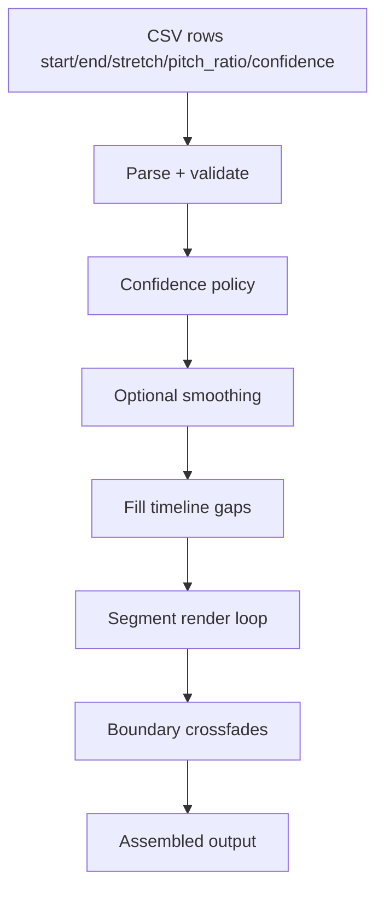

## 8.1) Control-Rate Interpolation Graph Examples

The same control points produce different trajectories depending on `--interp` and `--order`.

| Mode/order | Graph |
| --- | --- |
| `none` |  |
| `nearest` |  |
| `linear` |  |
| `cubic` |  |
| `polynomial --order 1` |  |
| `polynomial --order 2` |  |
| `polynomial --order 3` |  |
| `polynomial --order 5` |  |

## 8.2) Function Graph Gallery

| Function family | Graph |
| --- | --- |
| Pitch ratio vs semitones |  |
| Pitch ratio vs cents |  |
| Dynamics transfer curves |  |
| Soft clip transfer functions |  |
| Morph blend magnitude curves |  |
| Mask exponent response |  |
| Phase mix curve |  |

## 9) Extreme Stretch: Multistage Strategy

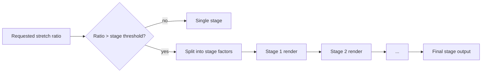

```text
example total stretch = 600x
600 = 5 * 5 * 4.8 * 5
render sequentially with safer stage factors
```

## 10) Transform Backend Decision Path

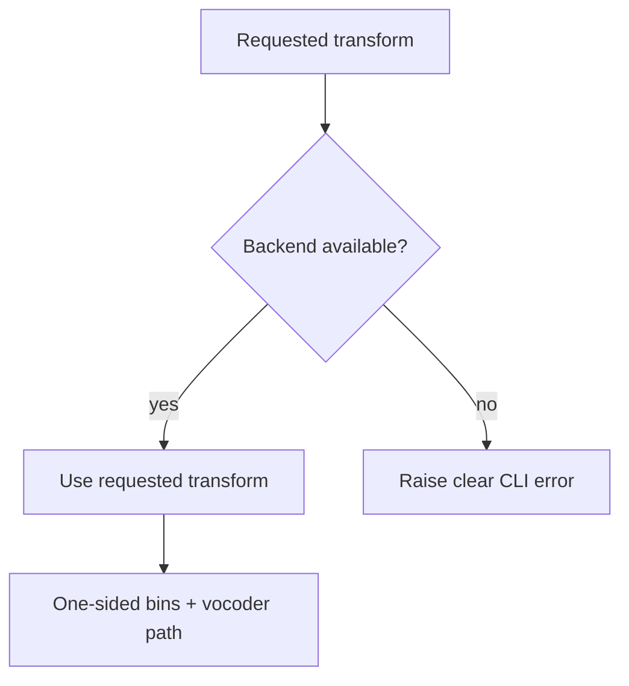

```text
preferred default: fft
research/verification: dft/czt/dct/dst/hartley
```

## 11) Mastering Chain Block Diagram

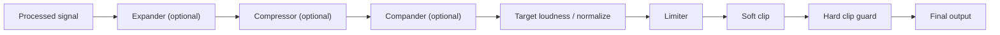

## 12) Metrics Printing Path

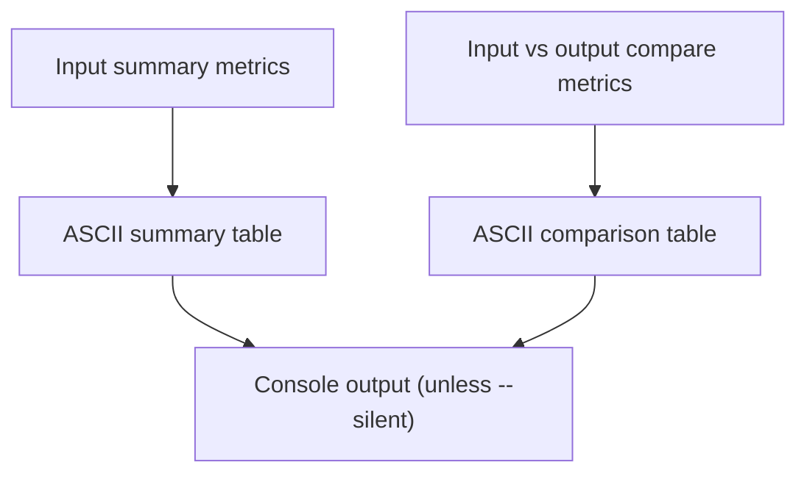

## 13) Benchmark Runner + CI Gate

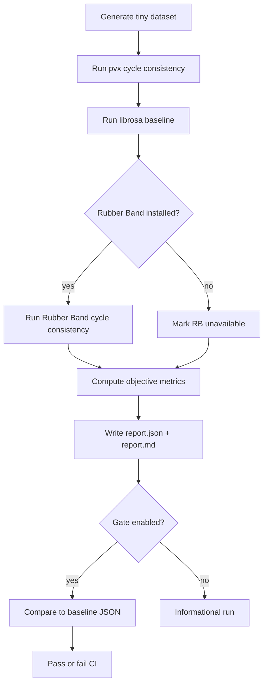

## 14) Pipe Chaining Pattern

```text
python3 pvxvoc.py input.wav --stdout \
| python3 pvxdenoise.py - --stdout \
| python3 pvxdeverb.py - --output final.wav

rule:
- producer uses --stdout
- consumer reads '-' as stdin
```

## 15) Checkpoint / Resume State Machine

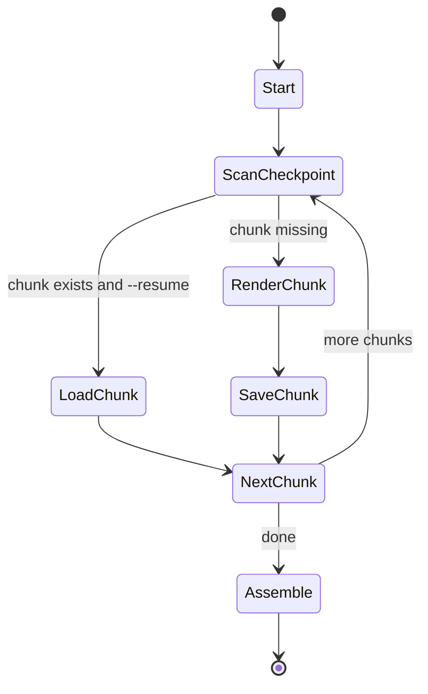

## 16) Troubleshooting Decision Tree

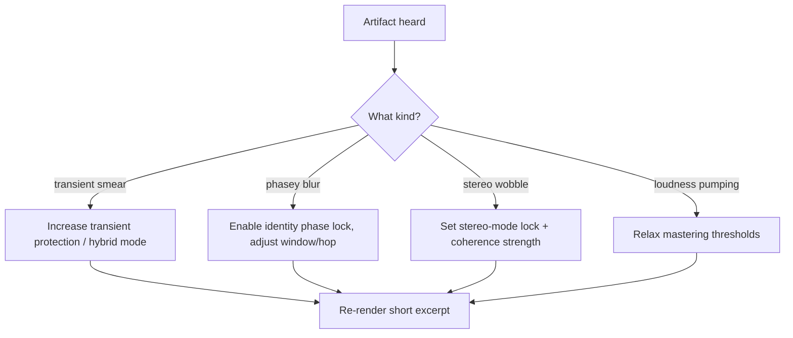

## 17) Data Product Map

```text
markdown docs  -> docs/*.md
html docs      -> docs/html/*.html
pdf bundle     -> docs/pvx_documentation.pdf
benchmark json -> benchmarks/out/report.json
benchmark md   -> benchmarks/out/report.md
```

## 18) Window/Overlap Tradeoff Map

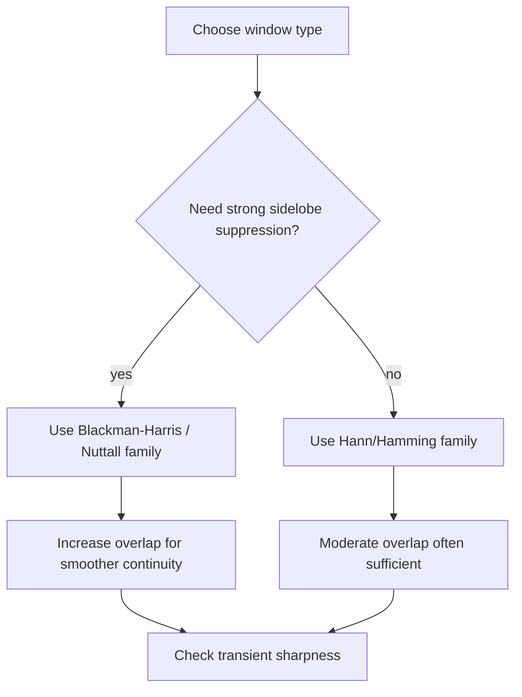

```text
larger window + higher overlap  -> smoother/cleaner sustained content
smaller window + lower overlap  -> sharper time localization, rougher bass resolution
```

## 19) Phase Reset vs Hybrid Boundary Behavior

```text
time -------------------------------------------------------->
transient mask:      000011100000001110000

mode=reset:
phase tracks   ----->|reset|--------->|reset|------->

mode=hybrid:
pv steady      -----[PV]-----     -----[PV]-----
wsola transient      [WSOLA]           [WSOLA]
stitch               <xfade>           <xfade>
```

## 20) Multi-Resolution Fusion Fan-In

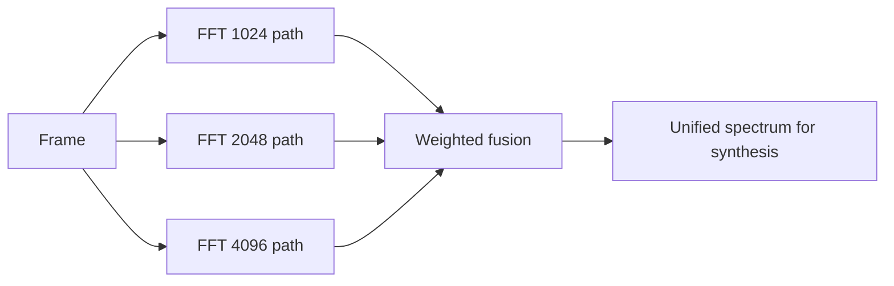

## 21) Pitch-Map Confidence Gate

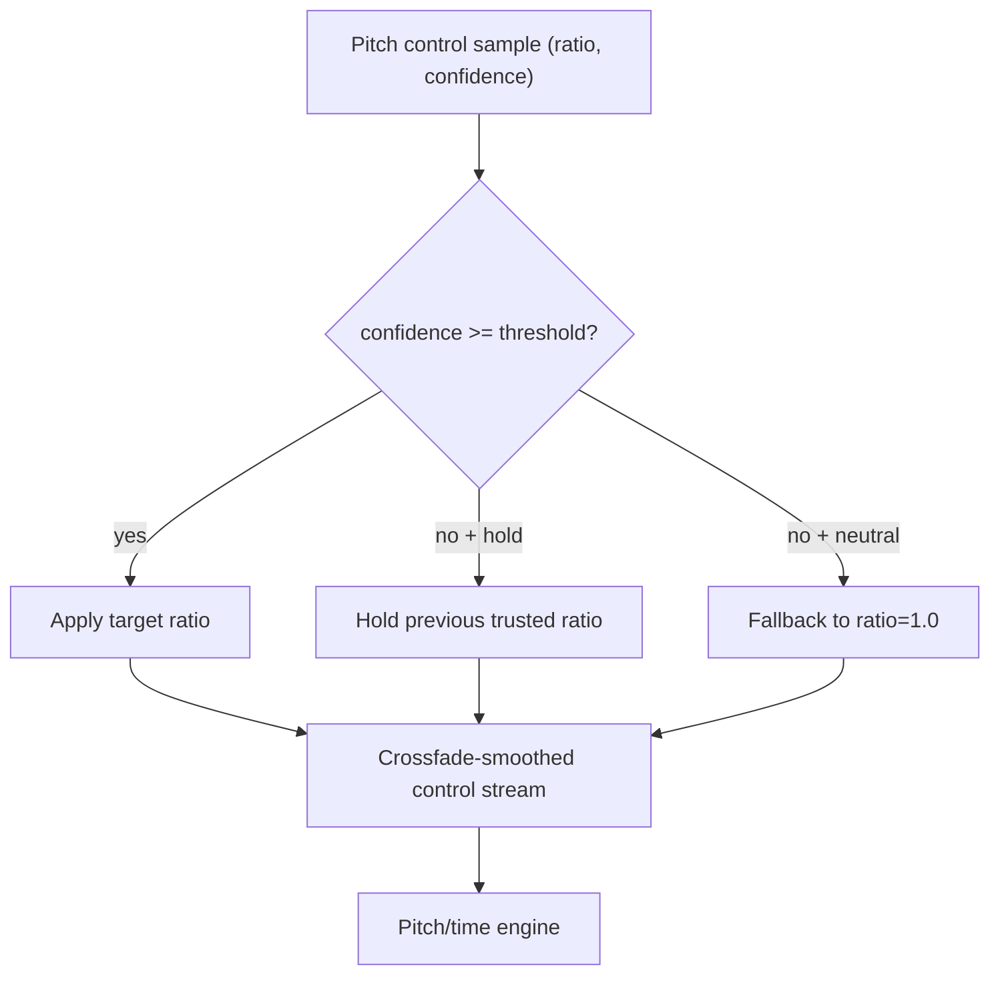

## 22) Microtonal CSV Interpolation Flow

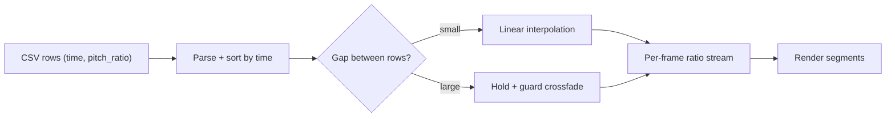

## 23) Audio Metrics Table Generation

```text
input.wav  -> basic metrics (sr,ch,duration,peak,rms,crest,dc,zcr,bw95,clip%)
output.wav -> basic metrics (same fields)
paired cmp -> compare metrics (snr,si-sdr,lsd,mod-dist,envelope corr,...)

console:
  table A: input summary
  table B: output summary
  table C: input vs output (input / output / delta)
```

## 24) Quality-First Optimization Loop

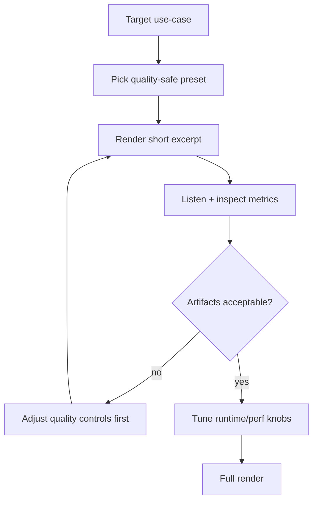

## 25) Benchmark Metric Taxonomy

```mermaid
flowchart TD
    A["Metric families"] --> B["Spectral: LSD, convergence, modulation"]
    A --> C["Time/transient: onset F1, smear, attack error"]
    A --> D["Level/loudness: LUFS, true-peak, crest"]
    A --> E["Speech/perceptual: STOI/ESTOI/PESQ proxies"]
    A --> F["Spatial: ILD/ITD/IPD drift, coherence"]
    B --> G["Regression gate"]
    C --> G
    D --> G
    E --> G
    F --> G
```

## 26) Documentation Build Pipeline

```mermaid
flowchart LR
    A["docs/*.md"] --> B["scripts/scripts_generate_html_docs.py"]
    B --> C["docs/html/*.html"]
    C --> D["scripts/scripts_generate_docs_pdf.py"]
    D --> E["docs/pvx_documentation.pdf"]
```

Use this atlas together with:
- `docs/MATHEMATICAL_FOUNDATIONS.md` for equation-level details
- `docs/EXAMPLES.md` for copy-paste command recipes

## Attribution

Copyright (c) 2026 Colby Leider and contributors. See [ATTRIBUTION.md](../ATTRIBUTION.md).
