# pvx Window Reference

_Generated from commit `2d0fab0` (commit date: 2026-02-23T12:29:02-05:00)._

pvx currently supports **50** analysis windows. This file defines each one mathematically and explains it in plain English.

## Notation

- Window length: $N$
- Sample index: $n \in \{0,\dots,N-1\}$
- Center index: $m=(N-1)/2$
- Normalized center coordinate: $x_n=(n-m)/m$

## Formula Key

**(W0) Rectangular**

$$w[n]=1$$

**(W1) Cosine series**

$$w[n]=\sum_{k=0}^{K} a_k\cos\left(\frac{2\pi k n}{N-1}\right)$$

**(W2) Sine/Cosine**

$$w[n]=\sin\left(\frac{\pi n}{N-1}\right)$$

**(W3) Bartlett**

$$w[n]=1-\left|\frac{n-m}{m}\right|$$

**(W4) Triangular**

$$w[n]=\max\left(1-\left|\frac{n-m}{(N+1)/2}\right|,0\right)$$

**(W5) Bartlett-Hann**

$$x=\frac{n}{N-1}-\frac{1}{2},\quad w[n]=0.62-0.48|x|+0.38\cos(2\pi x)$$

**(W6) Tukey**

$$
x=\frac{n}{N-1},\quad
w[n]=\begin{cases}
\frac{1}{2}\left(1+\cos\left(\pi\left(\frac{2x}{\alpha}-1\right)\right)\right), & 0\le x<\frac{\alpha}{2} \\
1, & \frac{\alpha}{2}\le x<1-\frac{\alpha}{2} \\
\frac{1}{2}\left(1+\cos\left(\pi\left(\frac{2x}{\alpha}-\frac{2}{\alpha}+1\right)\right)\right), & 1-\frac{\alpha}{2}\le x\le 1
\end{cases}
$$

Special cases in pvx: $\alpha\le 0$ gives rectangular behavior, and $\alpha\ge 1$ collapses to Hann.

**(W7) Parzen**

$$
u=\left|\frac{2n}{N-1}-1\right|,\quad
w[n]=\begin{cases}
1-6u^2+6u^3, & 0\le u\le \frac{1}{2} \\
2(1-u)^3, & \frac{1}{2}<u\le 1 \\
0, & u>1
\end{cases}
$$

**(W8) Lanczos**

$$w[n]=\mathrm{sinc}\left(\frac{2n}{N-1}-1\right)$$

**(W9) Welch**

$$w[n]=\max\left(1-x_n^2,0\right)$$

**(W10) Gaussian**

$$w[n]=\exp\left(-\frac{1}{2}\left(\frac{n-m}{\sigma}\right)^2\right),\quad \sigma=r_\sigma m$$

**(W11) General Gaussian**

$$w[n]=\exp\left(-\frac{1}{2}\left|\frac{n-m}{\sigma}\right|^{2p}\right)$$

**(W12) Exponential**

$$w[n]=\exp\left(-\frac{|n-m|}{\tau}\right),\quad \tau=r_\tau m$$

**(W13) Cauchy**

$$w[n]=\frac{1}{1+\left(\frac{n-m}{\gamma}\right)^2},\quad \gamma=r_\gamma m$$

**(W14) Cosine power**

$$w[n]=\sin\left(\frac{\pi n}{N-1}\right)^p$$

**(W15) Hann-Poisson**

$$w[n]=w_{\text{Hann}}[n]\exp\left(-\alpha\frac{|n-m|}{m}\right)$$

**(W16) General Hamming**

$$w[n]=\alpha-(1-\alpha)\cos\left(\frac{2\pi n}{N-1}\right)$$

**(W17) Bohman**

$$x=\left|\frac{2n}{N-1}-1\right|,\quad w[n]=(1-x)\cos(\pi x)+\frac{\sin(\pi x)}{\pi}$$

**(W18) Kaiser-Bessel**

$$w[n]=\frac{I_0\left(\beta\sqrt{1-r_n^2}\right)}{I_0(\beta)},\quad r_n=\frac{n-m}{m}$$

Each supported pvx window maps to one of the formula families above with the per-window constants shown below.

## Quantitative Metrics

- Coherent gain: $CG=\frac{1}{N}\sum_{n=0}^{N-1}w[n]$
- Equivalent noise bandwidth (bins): $ENBW=\frac{N\sum_n w[n]^2}{(\sum_n w[n])^2}$
- Scalloping loss (dB): response ratio at a half-bin sinusoid offset
- Main-lobe width (bins): measured from the first post-DC local minimum in zero-padded FFT magnitude
- Peak sidelobe (dB): maximum sidelobe level outside the main lobe

## Complete Window Catalog

| Window | Family | Parameters | Formula | Coherent gain | ENBW (bins) | Scalloping loss (dB) | Main-lobe width (bins) | Peak sidelobe (dB) | Plots | Pros | Cons | Usage advice |
| --- | --- | --- | --- | ---: | ---: | ---: | ---: | ---: | --- | --- | --- | --- |
| `hann` | Cosine series | `coeffs=(0.5, -0.5)` | W1 | 0.499756 | 1.500733 | -1.422 | 4.000 | -31.468 | [time](assets/windows/hann_time.svg) / [freq](assets/windows/hann_freq.svg) | Balanced leakage suppression and frequency resolution. | Not optimal for amplitude metering or extreme sidelobe rejection. | Default choice for most pvx time-stretch and pitch-shift workflows. |
| `hamming` | Cosine series | `coeffs=(0.54, -0.46)` | W1 | 0.539775 | 1.363305 | -1.750 | 4.000 | -42.675 | [time](assets/windows/hamming_time.svg) / [freq](assets/windows/hamming_freq.svg) | Balanced leakage suppression and frequency resolution. | Not optimal for amplitude metering or extreme sidelobe rejection. | Default choice for most pvx time-stretch and pitch-shift workflows. |
| `blackman` | Cosine series | `coeffs=(0.42, -0.5, 0.08)` | W1 | 0.419795 | 1.727601 | -1.098 | 6.000 | -58.109 | [time](assets/windows/blackman_time.svg) / [freq](assets/windows/blackman_freq.svg) | Strong sidelobe suppression for cleaner spectral separation. | Wider main lobe than Hann/Hamming. | Use for dense harmonic material when leakage artifacts dominate. |
| `blackmanharris` | Cosine series | `coeffs=(0.35875, -0.48829, 0.14128, -0.01168)` | W1 | 0.358575 | 2.005332 | -0.825 | 8.000 | -92.011 | [time](assets/windows/blackmanharris_time.svg) / [freq](assets/windows/blackmanharris_freq.svg) | Strong sidelobe suppression for cleaner spectral separation. | Wider main lobe than Hann/Hamming. | Use for dense harmonic material when leakage artifacts dominate. |
| `nuttall` | Cosine series | `coeffs=(0.355768, -0.487396, 0.144232, -0.012604)` | W1 | 0.355594 | 2.022220 | -0.811 | 8.000 | -93.325 | [time](assets/windows/nuttall_time.svg) / [freq](assets/windows/nuttall_freq.svg) | Strong sidelobe suppression for cleaner spectral separation. | Wider main lobe than Hann/Hamming. | Use for dense harmonic material when leakage artifacts dominate. |
| `flattop` | Cosine series | `coeffs=(1, -1.93, 1.29, -0.388, 0.0322)` | W1 | 0.999514 | 3.772117 | -0.016 | 10.000 | -68.311 | [time](assets/windows/flattop_time.svg) / [freq](assets/windows/flattop_freq.svg) | Very accurate amplitude estimation in FFT bins. | Very wide main lobe and reduced frequency discrimination. | Use for measurement-grade magnitude tracking, not fine pitch separation. |
| `blackman_nuttall` | Cosine series | `coeffs=(0.363582, -0.489177, 0.1366, -0.0106411)` | W1 | 0.363405 | 1.977073 | -0.850 | 8.000 | -98.174 | [time](assets/windows/blackman_nuttall_time.svg) / [freq](assets/windows/blackman_nuttall_freq.svg) | Strong sidelobe suppression for cleaner spectral separation. | Wider main lobe than Hann/Hamming. | Use for dense harmonic material when leakage artifacts dominate. |
| `exact_blackman` | Cosine series | `coeffs=(0.426591, -0.496561, 0.0768487)` | W1 | 0.426386 | 1.694500 | -1.149 | 6.000 | -68.236 | [time](assets/windows/exact_blackman_time.svg) / [freq](assets/windows/exact_blackman_freq.svg) | Strong sidelobe suppression for cleaner spectral separation. | Wider main lobe than Hann/Hamming. | Use for dense harmonic material when leakage artifacts dominate. |
| `sine` | Sinusoidal | `none` | W2 | 0.636309 | 1.234304 | -2.096 | 3.000 | -22.999 | [time](assets/windows/sine_time.svg) / [freq](assets/windows/sine_freq.svg) | Smooth endpoint behavior and straightforward implementation. | Less configurable than Kaiser/Tukey families. | Use for stable, low-complexity alternatives to Hann. |
| `bartlett` | Triangular | `none` | W3 | 0.499756 | 1.333985 | -1.822 | 4.000 | -26.523 | [time](assets/windows/bartlett_time.svg) / [freq](assets/windows/bartlett_freq.svg) | Cheap linear taper with intuitive behavior. | Higher sidelobes than stronger cosine-sum windows. | Use for low-cost processing or quick exploratory runs. |
| `boxcar` | Rectangular | `none` | W0 | 1.000000 | 1.000000 | -3.922 | 2.000 | -13.264 | [time](assets/windows/boxcar_time.svg) / [freq](assets/windows/boxcar_freq.svg) | Narrowest main lobe and maximal bin sharpness. | Highest sidelobes and strongest leakage/phasiness on non-bin-centered content. | Use only for controlled test tones or when leakage is acceptable. |
| `triangular` | Triangular | `none` | W4 | 0.500244 | 1.332683 | -1.826 | 4.000 | -26.523 | [time](assets/windows/triangular_time.svg) / [freq](assets/windows/triangular_freq.svg) | Cheap linear taper with intuitive behavior. | Higher sidelobes than stronger cosine-sum windows. | Use for low-cost processing or quick exploratory runs. |
| `bartlett_hann` | Hybrid taper | `fixed coefficients` | W5 | 0.499756 | 1.456559 | -1.517 | 4.000 | -35.874 | [time](assets/windows/bartlett_hann_time.svg) / [freq](assets/windows/bartlett_hann_freq.svg) | Moderate leakage suppression with lightweight computation. | Less common and less interpretable than standard Hann/Hamming. | Use as a middle-ground taper when Bartlett feels too sharp. |
| `tukey` | Tukey | `alpha=0.5` | W6 | 0.749634 | 1.222819 | -2.236 | 2.656 | -15.123 | [time](assets/windows/tukey_time.svg) / [freq](assets/windows/tukey_freq.svg) | Interpolates between rectangular and Hann behavior. | Behavior changes strongly with alpha and can be inconsistent across presets. | Use when you need a controllable flat center with soft edges. |
| `tukey_0p1` | Tukey | `alpha=0.1` | W6 | 0.949536 | 1.039289 | -3.505 | 2.094 | -13.309 | [time](assets/windows/tukey_0p1_time.svg) / [freq](assets/windows/tukey_0p1_freq.svg) | Interpolates between rectangular and Hann behavior. | Behavior changes strongly with alpha and can be inconsistent across presets. | Use when you need a controllable flat center with soft edges. |
| `tukey_0p25` | Tukey | `alpha=0.25` | W6 | 0.874573 | 1.102579 | -2.960 | 2.281 | -13.601 | [time](assets/windows/tukey_0p25_time.svg) / [freq](assets/windows/tukey_0p25_freq.svg) | Interpolates between rectangular and Hann behavior. | Behavior changes strongly with alpha and can be inconsistent across presets. | Use when you need a controllable flat center with soft edges. |
| `tukey_0p75` | Tukey | `alpha=0.75` | W6 | 0.624695 | 1.360664 | -1.728 | 3.188 | -19.395 | [time](assets/windows/tukey_0p75_time.svg) / [freq](assets/windows/tukey_0p75_freq.svg) | Interpolates between rectangular and Hann behavior. | Behavior changes strongly with alpha and can be inconsistent across presets. | Use when you need a controllable flat center with soft edges. |
| `tukey_0p9` | Tukey | `alpha=0.9` | W6 | 0.549731 | 1.446988 | -1.521 | 3.625 | -24.972 | [time](assets/windows/tukey_0p9_time.svg) / [freq](assets/windows/tukey_0p9_freq.svg) | Interpolates between rectangular and Hann behavior. | Behavior changes strongly with alpha and can be inconsistent across presets. | Use when you need a controllable flat center with soft edges. |
| `parzen` | Polynomial | `piecewise cubic` | W7 | 0.374817 | 1.918397 | -0.897 | 8.000 | -53.046 | [time](assets/windows/parzen_time.svg) / [freq](assets/windows/parzen_freq.svg) | Smooth high-order taper with good sidelobe control. | Broader main lobe than lightweight windows. | Use for spectral denoising/analysis where sidelobe cleanup is critical. |
| `lanczos` | Sinc | `none` | W8 | 0.589202 | 1.299668 | -1.889 | 3.281 | -26.405 | [time](assets/windows/lanczos_time.svg) / [freq](assets/windows/lanczos_freq.svg) | Sinc-derived shape with useful compromise behavior. | Can exhibit oscillatory spectral behavior versus cosine-sum defaults. | Use for interpolation-adjacent analysis experiments. |
| `welch` | Quadratic | `none` | W9 | 0.666341 | 1.200587 | -2.223 | 2.875 | -21.295 | [time](assets/windows/welch_time.svg) / [freq](assets/windows/welch_freq.svg) | Center-emphasizing parabola with simple form. | Not as strong at sidelobe suppression as Blackman-family windows. | Use when center weighting is desired with minimal complexity. |
| `gaussian_0p25` | Gaussian | `sigma_ratio=0.25` | W10 | 0.313156 | 2.258144 | -0.668 | 11.406 | -87.677 | [time](assets/windows/gaussian_0p25_time.svg) / [freq](assets/windows/gaussian_0p25_freq.svg) | Smooth bell taper with low ringing and predictable decay. | Frequency resolution changes noticeably with sigma. | Use sigma presets to tune transient locality versus spectral leakage. |
| `gaussian_0p35` | Gaussian | `sigma_ratio=0.35` | W10 | 0.436580 | 1.626488 | -1.268 | 6.719 | -52.077 | [time](assets/windows/gaussian_0p35_time.svg) / [freq](assets/windows/gaussian_0p35_freq.svg) | Smooth bell taper with low ringing and predictable decay. | Frequency resolution changes noticeably with sigma. | Use sigma presets to tune transient locality versus spectral leakage. |
| `gaussian_0p45` | Gaussian | `sigma_ratio=0.45` | W10 | 0.548949 | 1.320556 | -1.869 | 4.125 | -35.366 | [time](assets/windows/gaussian_0p45_time.svg) / [freq](assets/windows/gaussian_0p45_freq.svg) | Smooth bell taper with low ringing and predictable decay. | Frequency resolution changes noticeably with sigma. | Use sigma presets to tune transient locality versus spectral leakage. |
| `gaussian_0p55` | Gaussian | `sigma_ratio=0.55` | W10 | 0.641515 | 1.171861 | -2.350 | 3.000 | -28.906 | [time](assets/windows/gaussian_0p55_time.svg) / [freq](assets/windows/gaussian_0p55_freq.svg) | Smooth bell taper with low ringing and predictable decay. | Frequency resolution changes noticeably with sigma. | Use sigma presets to tune transient locality versus spectral leakage. |
| `gaussian_0p65` | Gaussian | `sigma_ratio=0.65` | W10 | 0.713490 | 1.097657 | -2.705 | 2.625 | -22.575 | [time](assets/windows/gaussian_0p65_time.svg) / [freq](assets/windows/gaussian_0p65_freq.svg) | Smooth bell taper with low ringing and predictable decay. | Frequency resolution changes noticeably with sigma. | Use sigma presets to tune transient locality versus spectral leakage. |
| `general_gaussian_1p5_0p35` | Generalized Gaussian | `power=1.5, sigma_ratio=0.35` | W11 | 0.393587 | 2.016584 | -0.784 | 5.156 | -24.895 | [time](assets/windows/general_gaussian_1p5_0p35_time.svg) / [freq](assets/windows/general_gaussian_1p5_0p35_freq.svg) | Additional shape control beyond standard Gaussian. | Extra parameterization increases tuning complexity. | Use for research/tuning tasks where shoulder steepness matters. |
| `general_gaussian_2p0_0p35` | Generalized Gaussian | `power=2, sigma_ratio=0.35` | W11 | 0.377081 | 2.230016 | -0.633 | 5.281 | -19.717 | [time](assets/windows/general_gaussian_2p0_0p35_time.svg) / [freq](assets/windows/general_gaussian_2p0_0p35_freq.svg) | Additional shape control beyond standard Gaussian. | Extra parameterization increases tuning complexity. | Use for research/tuning tasks where shoulder steepness matters. |
| `general_gaussian_3p0_0p35` | Generalized Gaussian | `power=3, sigma_ratio=0.35` | W11 | 0.364287 | 2.445593 | -0.532 | 5.469 | -16.299 | [time](assets/windows/general_gaussian_3p0_0p35_time.svg) / [freq](assets/windows/general_gaussian_3p0_0p35_freq.svg) | Additional shape control beyond standard Gaussian. | Extra parameterization increases tuning complexity. | Use for research/tuning tasks where shoulder steepness matters. |
| `general_gaussian_4p0_0p35` | Generalized Gaussian | `power=4, sigma_ratio=0.35` | W11 | 0.359267 | 2.552433 | -0.496 | 5.562 | -15.060 | [time](assets/windows/general_gaussian_4p0_0p35_time.svg) / [freq](assets/windows/general_gaussian_4p0_0p35_freq.svg) | Additional shape control beyond standard Gaussian. | Extra parameterization increases tuning complexity. | Use for research/tuning tasks where shoulder steepness matters. |
| `exponential_0p25` | Exponential | `tau_ratio=0.25` | W12 | 0.245310 | 2.075492 | -1.022 | 15.562 | -31.885 | [time](assets/windows/exponential_0p25_time.svg) / [freq](assets/windows/exponential_0p25_freq.svg) | Simple edge decay with fast computation. | Can produce less-uniform center weighting than cosine families. | Use for experiments emphasizing center-heavy weighting. |
| `exponential_0p5` | Exponential | `tau_ratio=0.5` | W12 | 0.432187 | 1.313323 | -2.032 | 3.625 | -19.190 | [time](assets/windows/exponential_0p5_time.svg) / [freq](assets/windows/exponential_0p5_freq.svg) | Simple edge decay with fast computation. | Can produce less-uniform center weighting than cosine families. | Use for experiments emphasizing center-heavy weighting. |
| `exponential_1p0` | Exponential | `tau_ratio=1` | W12 | 0.631991 | 1.082055 | -2.854 | 2.594 | -20.141 | [time](assets/windows/exponential_1p0_time.svg) / [freq](assets/windows/exponential_1p0_freq.svg) | Simple edge decay with fast computation. | Can produce less-uniform center weighting than cosine families. | Use for experiments emphasizing center-heavy weighting. |
| `cauchy_0p5` | Cauchy / Lorentzian | `gamma_ratio=0.5` | W13 | 0.553402 | 1.229775 | -2.209 | 3.562 | -22.733 | [time](assets/windows/cauchy_0p5_time.svg) / [freq](assets/windows/cauchy_0p5_freq.svg) | Heavy tails preserve more peripheral samples than Gaussian. | Tail energy can increase leakage relative to steeper tapers. | Use when you want softer attenuation of far-window samples. |
| `cauchy_1p0` | Cauchy / Lorentzian | `gamma_ratio=1` | W13 | 0.785259 | 1.041963 | -3.108 | 2.375 | -19.034 | [time](assets/windows/cauchy_1p0_time.svg) / [freq](assets/windows/cauchy_1p0_freq.svg) | Heavy tails preserve more peripheral samples than Gaussian. | Tail energy can increase leakage relative to steeper tapers. | Use when you want softer attenuation of far-window samples. |
| `cauchy_2p0` | Cauchy / Lorentzian | `gamma_ratio=2` | W13 | 0.927233 | 1.004393 | -3.648 | 2.094 | -14.689 | [time](assets/windows/cauchy_2p0_time.svg) / [freq](assets/windows/cauchy_2p0_freq.svg) | Heavy tails preserve more peripheral samples than Gaussian. | Tail energy can increase leakage relative to steeper tapers. | Use when you want softer attenuation of far-window samples. |
| `cosine_power_2` | Cosine power | `power=2` | W14 | 0.499756 | 1.500733 | -1.422 | 4.000 | -31.468 | [time](assets/windows/cosine_power_2_time.svg) / [freq](assets/windows/cosine_power_2_freq.svg) | Simple power parameter controls edge steepness. | Higher powers can overly narrow effective support. | Use to smoothly increase edge attenuation versus basic sine. |
| `cosine_power_3` | Cosine power | `power=3` | W14 | 0.424206 | 1.735739 | -1.074 | 5.000 | -39.295 | [time](assets/windows/cosine_power_3_time.svg) / [freq](assets/windows/cosine_power_3_freq.svg) | Simple power parameter controls edge steepness. | Higher powers can overly narrow effective support. | Use to smoothly increase edge attenuation versus basic sine. |
| `cosine_power_4` | Cosine power | `power=4` | W14 | 0.374817 | 1.945394 | -0.862 | 6.000 | -46.741 | [time](assets/windows/cosine_power_4_time.svg) / [freq](assets/windows/cosine_power_4_freq.svg) | Simple power parameter controls edge steepness. | Higher powers can overly narrow effective support. | Use to smoothly increase edge attenuation versus basic sine. |
| `hann_poisson_0p5` | Hann-Poisson | `alpha=0.5` | W15 | 0.432946 | 1.609944 | -1.258 | 5.188 | -35.245 | [time](assets/windows/hann_poisson_0p5_time.svg) / [freq](assets/windows/hann_poisson_0p5_freq.svg) | Combines smooth Hann center with exponential edge suppression. | Can over-attenuate edges for high alpha values. | Use when you need stronger edge decay than Hann without full flattop cost. |
| `hann_poisson_1p0` | Hann-Poisson | `alpha=1` | W15 | 0.378797 | 1.734176 | -1.112 | 103.750 | -80.017 | [time](assets/windows/hann_poisson_1p0_time.svg) / [freq](assets/windows/hann_poisson_1p0_freq.svg) | Combines smooth Hann center with exponential edge suppression. | Can over-attenuate edges for high alpha values. | Use when you need stronger edge decay than Hann without full flattop cost. |
| `hann_poisson_2p0` | Hann-Poisson | `alpha=2` | W15 | 0.297878 | 2.023174 | -0.870 | 164.719 | -80.005 | [time](assets/windows/hann_poisson_2p0_time.svg) / [freq](assets/windows/hann_poisson_2p0_freq.svg) | Combines smooth Hann center with exponential edge suppression. | Can over-attenuate edges for high alpha values. | Use when you need stronger edge decay than Hann without full flattop cost. |
| `general_hamming_0p50` | General Hamming | `alpha=0.50` | W16 | 0.499756 | 1.500733 | -1.422 | 4.000 | -31.468 | [time](assets/windows/general_hamming_0p50_time.svg) / [freq](assets/windows/general_hamming_0p50_freq.svg) | Tunable Hamming-style cosine weighting. | Less standardized than classic Hann/Hamming choices. | Use to sweep sidelobe-vs-width behavior near Hamming family defaults. |
| `general_hamming_0p60` | General Hamming | `alpha=0.60` | W16 | 0.599805 | 1.222475 | -2.179 | 3.469 | -31.600 | [time](assets/windows/general_hamming_0p60_time.svg) / [freq](assets/windows/general_hamming_0p60_freq.svg) | Tunable Hamming-style cosine weighting. | Less standardized than classic Hann/Hamming choices. | Use to sweep sidelobe-vs-width behavior near Hamming family defaults. |
| `general_hamming_0p70` | General Hamming | `alpha=0.70` | W16 | 0.699854 | 1.091920 | -2.762 | 2.656 | -24.078 | [time](assets/windows/general_hamming_0p70_time.svg) / [freq](assets/windows/general_hamming_0p70_freq.svg) | Tunable Hamming-style cosine weighting. | Less standardized than classic Hann/Hamming choices. | Use to sweep sidelobe-vs-width behavior near Hamming family defaults. |
| `general_hamming_0p80` | General Hamming | `alpha=0.80` | W16 | 0.799902 | 1.031273 | -3.227 | 2.312 | -18.649 | [time](assets/windows/general_hamming_0p80_time.svg) / [freq](assets/windows/general_hamming_0p80_freq.svg) | Tunable Hamming-style cosine weighting. | Less standardized than classic Hann/Hamming choices. | Use to sweep sidelobe-vs-width behavior near Hamming family defaults. |
| `bohman` | Bohman | `none` | W17 | 0.405087 | 1.786613 | -1.022 | 6.000 | -45.997 | [time](assets/windows/bohman_time.svg) / [freq](assets/windows/bohman_freq.svg) | Continuous-slope taper with good qualitative leakage control. | Less common in audio tooling and harder to tune by intuition. | Use for exploratory spectral work needing smooth derivatives. |
| `cosine` | Sinusoidal | `none` | W2 | 0.636309 | 1.234304 | -2.096 | 3.000 | -22.999 | [time](assets/windows/cosine_time.svg) / [freq](assets/windows/cosine_freq.svg) | Smooth endpoint behavior and straightforward implementation. | Less configurable than Kaiser/Tukey families. | Use for stable, low-complexity alternatives to Hann. |
| `kaiser` | Kaiser-Bessel | `beta from --kaiser-beta` | W18 | 0.331708 | 2.162181 | -0.712 | 9.125 | -105.921 | [time](assets/windows/kaiser_time.svg) / [freq](assets/windows/kaiser_freq.svg) | Continuously tunable width/sidelobe tradeoff via beta. | Needs beta tuning; poor beta choices can over-blur or under-suppress sidelobes. | Use when you need explicit control over leakage versus resolution. |
| `rect` | Rectangular | `none` | W0 | 1.000000 | 1.000000 | -3.922 | 2.000 | -13.264 | [time](assets/windows/rect_time.svg) / [freq](assets/windows/rect_freq.svg) | Narrowest main lobe and maximal bin sharpness. | Highest sidelobes and strongest leakage/phasiness on non-bin-centered content. | Use only for controlled test tones or when leakage is acceptable. |

## Complete Plot Gallery (All Windows)

| Window | Time-domain shape | Magnitude spectrum |
| --- | --- | --- |
| `hann` |  |  |
| `hamming` |  |  |
| `blackman` |  |  |
| `blackmanharris` |  |  |
| `nuttall` | 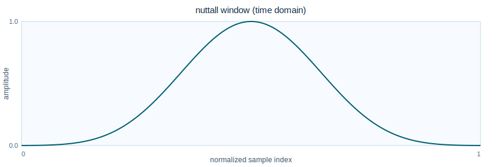 | 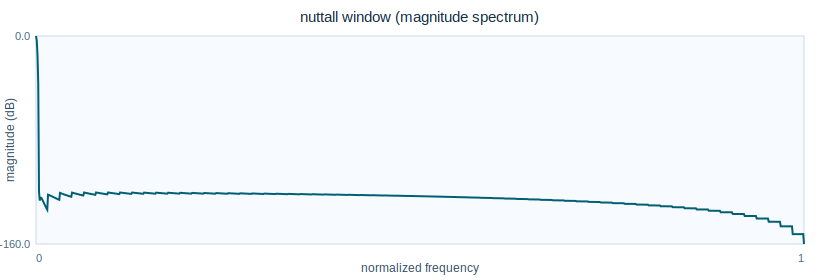 |
| `flattop` | 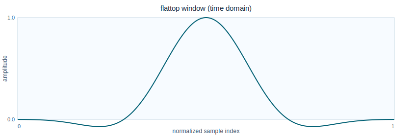 | 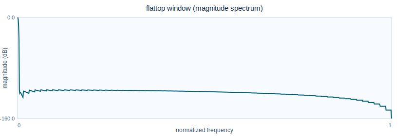 |
| `blackman_nuttall` |  |  |
| `exact_blackman` |  |  |
| `sine` | 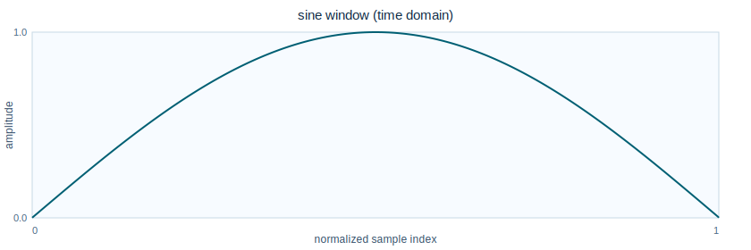 | 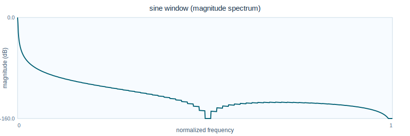 |
| `bartlett` |  |  |
| `boxcar` |  |  |
| `triangular` | 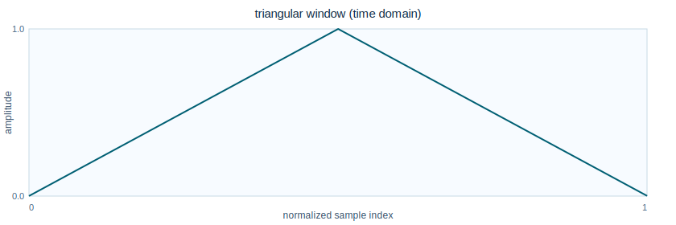 | 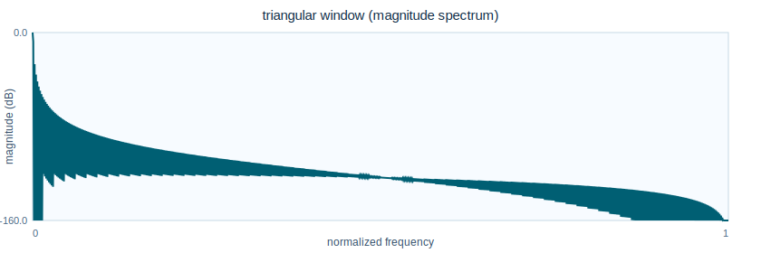 |
| `bartlett_hann` |  |  |
| `tukey` |  |  |
| `tukey_0p1` |  |  |
| `tukey_0p25` |  |  |
| `tukey_0p75` |  |  |
| `tukey_0p9` |  |  |
| `parzen` | 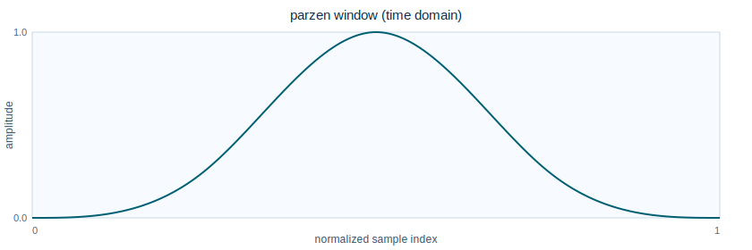 | 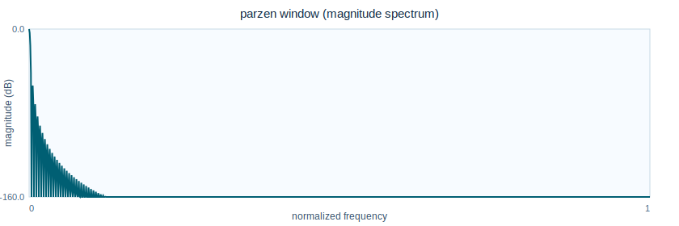 |
| `lanczos` |  |  |
| `welch` |  |  |
| `gaussian_0p25` |  |  |
| `gaussian_0p35` |  |  |
| `gaussian_0p45` |  |  |
| `gaussian_0p55` |  |  |
| `gaussian_0p65` |  |  |
| `general_gaussian_1p5_0p35` |  |  |
| `general_gaussian_2p0_0p35` |  |  |
| `general_gaussian_3p0_0p35` |  |  |
| `general_gaussian_4p0_0p35` |  |  |
| `exponential_0p25` |  |  |
| `exponential_0p5` |  |  |
| `exponential_1p0` |  |  |
| `cauchy_0p5` |  |  |
| `cauchy_1p0` |  |  |
| `cauchy_2p0` |  |  |
| `cosine_power_2` |  |  |
| `cosine_power_3` |  |  |
| `cosine_power_4` |  |  |
| `hann_poisson_0p5` |  |  |
| `hann_poisson_1p0` |  |  |
| `hann_poisson_2p0` |  |  |
| `general_hamming_0p50` |  |  |
| `general_hamming_0p60` |  |  |
| `general_hamming_0p70` |  |  |
| `general_hamming_0p80` |  |  |
| `bohman` |  |  |
| `cosine` | 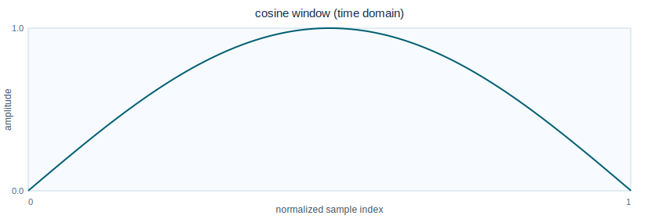 | 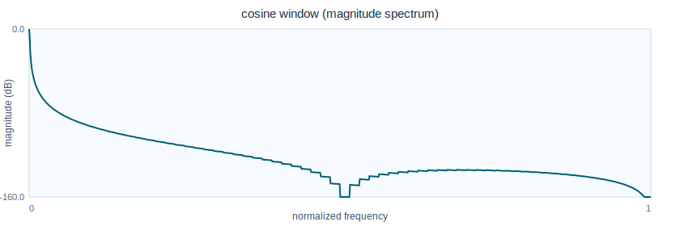 |
| `kaiser` |  |  |
| `rect` |  |  |

## Practical Selection Guidance

- Use `hann` or `hamming` for balanced everyday phase-vocoder work.
- Use `kaiser` when you need explicit sidelobe control with `--kaiser-beta`.
- Use `flattop` for amplitude-accuracy-focused spectral measurement.
- Use `tukey_*` when you want a controllable flat center region.
- Use Gaussian/Cauchy/Exponential families to experiment with edge-decay shape and time-locality.
